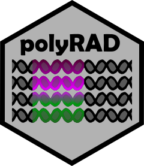

# polyRAD: Genotype Calling with Uncertainty from Sequencing Data in Polyploids and Diploids

The ultimate goal of polyRAD is to enable research that strives to end world hunger and conserve biodiversity.  On that note, I actively welcome input and contributions from diverse and underrepresented sources to help improve the software, and have adopted the [Contributor Covenant Code of Conduct](https://github.com/lvclark/polyRAD/blob/main/code_of_conduct.md).  If there is something I can do or add to make polyRAD more useful and approachable to you, [post an issue](https://github.com/lvclark/polyRAD/issues), start a [discussion](https://github.com/lvclark/polyRAD/discussions) or send me an [email](mailto:Lindsay.Clark@seattlechildrens.org)!  If you would like to create a new function yourself or propose edits to the code or documentation, feel free to make a pull request!  All levels of experience are welcome and you can contact me if you aren't sure how to get started with GitHub.

See the [list of future features](https://github.com/lvclark/polyRAD/wiki/todo) and [issues](https://github.com/lvclark/polyRAD/issues) for some of the things that I'm already thinking of adding to polyRAD.

polyRAD is available on CRAN or can be installed from this repository.

## Table of Contents



- [Purpose](#purpose)
- [Why polyRAD](#whypolyrad)
- [Formats supported](#formats)
- [Installation](#installation)
- [Tutorial](#tutorial)
- [Citation](#citation)
- [Need help with R?](#rhelp)
- [Funding](#funding)

## <a name="purpose"></a>Purpose

Genotypes derived from genotyping-by-sequencing (GBS) and restriction site-associated DNA sequencing (RAD-seq) have inherent uncertainty associated with them due to sampling error, i.e. some alleles might not get sequenced at all, or might not be sequenced in exact proportion to their copy number in the genome.  This package imports read depth in a variety of formats output by various bioinformatics pipelines and estimates the probability of each possible genotype for each taxon and locus.  Unlike similar pipelines, polyRAD can account for population structure and variable inheritance modes (autopolyploid, allopolyploid, intermediate).  Genotypes and/or probability distributions can then be exported for downstream analysis such as genome-wide association, genomic selection, QTL mapping, or population structure analysis.

Starting with version 1.2, polyRAD also includes its own variant calling pipeline.  It is designed for highly duplicated (typically allopolyploid) reference genomes, and can help correct and filter markers that appear to consist of multiple paralogous loci.  Even in non-duplicated genomes, the same statistic can be used for filtering non-Mendelian loci, as well as loci with considerable amounts of amplification bias and/or overdispersion in the sequencing data.  This filtering can be performed before genotype calling.

## <a name="whypolyrad"></a>Why polyRAD?

If you're like me, you don't want to waste a lot of money sequencing your DNA samples at a higher depth than is necessary.  You would rather spend that money adding more samples to the project, or using a different restriction enzyme to get more markers!  You may have also noticed that some loci get sequenced at a much higher depth than others, which means that if you sequence the same library a second time, you aren't likely to get a lot of reads for the loci that need it most.  So how can we get the maximum amount of information out of sequencing data where many loci are low depth?  And, for example, if we only have five reads, how can we estimate allele dosage in a heterozygous octoploid?

The answer that polyRAD provides is a Bayesian genotype caller with many options for specifying genotype prior probabilties.  When read depth is low, **accurate priors make a big difference in the accuracy of genotype calls.**  And because some genotype calls are going to be uncertain no matter how sophisticated our algorithm is, polyRAD can export genotypes as continuous numeric variables reflecting the probabilities of all possible allele copy numbers.  This includes genotypes with zero reads, where the priors themselves are used for imputation.

For an explanation of Bayesian genotype calling and posterior mean genotypes, see a [seminar](https://youtu.be/Z2xwLQYc8OA?t=1158) of mine.

**Genotype priors in diversity panels and natural populations:**

* Either assume no population structure (HWE), or let polyRAD infer population structure and model allele frequency gradients.
* The user specifies a rate of self-fertilization ranging anywhere from zero to one.
* If loci have known positions in a reference genome, polyRAD can search for loci in linkage disequilibrium and use those loci to update priors.

**Genotype priors in biparental mapping populations:**

* The user specifies the number of generations of backcrossing, intermating, and/or selfing.  (For an F1 population, all three would be zero.)
* Based on likely parental genotypes and allele frequencies in the progeny, polyRAD determines the segregation pattern of each marker.
* If the loci have known positions in a reference genome or on a map, linked markers can be used for updating priors.

In particular, by using population structure and linkage to inform genotype priors on a per-individual basis, high depth markers are used by polyRAD to improve the accuracy of genotyping at low depth markers.  All pipelines allow autopolyploidy, allopolyploidy, or some mixture of the two.  And because non-model organisms need some love, reference genomes are optional.

## <a name="formats"></a>Formats supported

To hopefully answer the question, "Can I use polyRAD?":

polyRAD requires as input the sequence read depth at each allele for each sample.  Alleles must also be grouped into loci.  The bioinformatics pipeline that you used for SNP discovery did not have to assume polyploidy, as long as it faithfully reported allelic read depth.  Genomic alignment information is optional.  Right now there are data import functions for the following formats:

* [Variant Call Format (VCF)](https://samtools.github.io/hts-specs/).  The allele depth (AD) genotype field must be present.  I have tested the import function on files produced by the [TASSEL GBSv2](https://bitbucket.org/tasseladmin/tassel-5-source/wiki/Tassel5GBSv2Pipeline) pipeline.  It should also work for [GATK](https://software.broadinstitute.org/gatk/) and [Tassel4-Poly](https://github.com/guilherme-pereira/tassel4-poly).
* [TagDigger](https://github.com/lvclark/tagdigger).  This is another piece of software I created, which reads FASTQ files and expected tag sequences and outputs a CSV file with read counts at samples x tags.
* [UNEAK](https://tassel.bitbucket.io/TasselArchived.html).  The UNEAK pipeline outputs read depth in a file called HapMap.hmc.txt, which can be read by polyRAD.  (Beware that read depth is capped at 127 by UNEAK; TagDigger can help you if you expect high depth to be common in your dataset.)
* [Stacks](http://catchenlab.life.illinois.edu/stacks/).  If you have catalog files (catalog.alleles.tsv etc.) and matches files (matches.tsv) generated by Stacks, they can be imported by polyRAD.
* [TASSEL-GBSv2](https://bitbucket.org/tasseladmin/tassel-5-source/wiki/Tassel5GBSv2Pipeline).  Rather than running the entire pipeline, you can run GBSSeqToTagDBPlugin, TagExportToFastqPlugin, Bowtie2 or BWA as described in "Run Alignment Program(s)", then GetTagTaxaDistFromDBPlugin to get the TagTaxaDist and SAM files needed for import by polyRAD.
* [DArTag](https://www.diversityarrays.com/).  This uses a custom format developed in conjunction with [Breeding Insight](https://breedinginsight.org/).

Currently there are export functions for the following software.  Genotypes are exported as continuous variables (posterior mean genotypes) for these four formats.  There are also functions to generate matrices of continuous or discrete genotypes, which can be used in custom export functions.

* [GAPIT](http://www.zzlab.net/GAPIT/) and [FarmCPU](http://www.zzlab.net/FarmCPU/)
* [rrBLUP](https://cran.r-project.org/web/packages/rrBLUP/)
* [TASSEL](http://www.maizegenetics.net/tassel)
* [GWASpoly](https://github.com/jendelman/GWASpoly)

There are export functions for discrete genotypes for the following software:

* [polymapR](https://cran.r-project.org/package=polymapR)
* [Structure](https://web.stanford.edu/group/pritchardlab/structure.html)
* [adegenet](https://github.com/thibautjombart/adegenet)

Discrete genotypes can also be exported to [VCF](https://samtools.github.io/hts-specs/) for import to a variety of software.

Genotype probabilities can be exported to:

* [MAPpoly](https://github.com/mmollina/MAPpoly)
* [polymapR](https://cran.r-project.org/package=polymapR)

## <a name="installation"></a>Installation

polyRAD depends on some Bioconductor packages.  Before attempting to install polyRAD, run

```
if (!requireNamespace("BiocManager", quietly = TRUE)){
  install.packages("BiocManager")
}

BiocManager::install("pcaMethods")
```

If you plan to import from or export to VCF, also run

```
BiocManager::install("VariantAnnotation")
```

polyRAD can then be installed from CRAN with

```
install.packages("polyRAD")
```

Alternatively, if there are new features not yet on the CRAN version that you
want to use, you can install the development version here on GitHub at your own
risk using the command

```
install.packages("polyRAD", repos = "https://lvclark.r-universe.dev")
```

## <a name="tutorial"></a>Tutorial

The tutorial document for the package is available [on R-universe](https://lvclark.r-universe.dev/articles/polyRAD/polyRADtutorial.html).

A separate tutorial is available for the [variant calling pipeline](https://lvclark.r-universe.dev/articles/polyRAD/isolocus_sorting.html).

A video tutorial from January 2021 is available on [YouTube](https://www.youtube.com/watch?v=vjwFBspNpRc).

A tutorial on [using polyRAD for population genetics](https://lvclark.r-universe.dev/articles/polyRADtutorials/population_genetics.html)
is also available.  If you would like to have the dataset to follow along with that tutorial, run
`install.packages("polyRADtutorials", repos = "https://lvclark.r-universe.dev")`.
The tutorial covers genotype calling in a wild collection of diploid, triploid,
and tetraploid _Miscanthus sacchariflorus_ (a perennial grass) and some downstream
applications in R.

The population genetics tutorial is also available as a
[video](https://mediaspace.illinois.edu/media/t/1_0v7b2qoe) from April 2022.
English closed captions are available for the video.

Note that the tutorials hosted on R-universe are derived from the development
version of polyRAD.  If you installed from CRAN and something from an R-universe
tutorial isn't working, check the tutorial that came with your installation using
`browseVignettes("polyRAD")`.

## <a name="citation"></a>Citation

If you use polyRAD, please cite this manuscript:

Clark LV, Lipka AE, and Sacks EJ (2019) polyRAD: Genotype calling with uncertainty from sequencing data in
polyploids and diploids.  *G3* 9(3) 663--673. doi:[10.1534/g3.118.200913](https://doi.org/10.1534/g3.118.200913)

The Hind/He statistic is described in the following manuscript:

Clark LV, Mays W, Lipka AE, and Sacks EJ (2022) A population-level statistic for
assessing Mendelian behavior of genotyping-by-sequencing data from highly
duplicated genomes. *BMC Bioinformatics* 23: 101,
[doi:10.1186/s12859-022-04635-9](https://doi.org/10.1186/s12859-022-04635-9).

The variant calling pipeline is described in version one of the preprint:

Clark LV, Mays W, Lipka AE, and Sacks EJ (2020) A population-level statistic for assessing Mendelian behavior of genotyping-by-sequencing data from highly duplicated genomes.  *bioRxiv* doi:[10.1101/2020.01.11.902890 ](https://doi.org/10.1101/2020.01.11.902890)

### Additional citations

Citable Zenodo DOI for the software:
[](https://zenodo.org/badge/latestdoi/99379777)

polyRAD has also been presented in these posters:

Clark LV, Lipka AE, and Sacks EJ (2019) Improvements to Genotype Calling in 
Polyploids Using the polyRAD R Package.  Plant and Animal Genome Conference 
XXVII, January 12-16, San Diego, California, USA.
doi:[10.13140/RG.2.2.18358.75847](https://doi.org/10.13140/RG.2.2.18358.75847)

Clark LV, Lipka AE, and Sacks EJ (2018) polyRAD: Genotype Calling with Uncertainty from Sequencing Data
in Polyploids and Diploids.  Plant and Animal Genome Conference XXVI, January 13-17, San Diego, California, USA.
doi:[10.13140/RG.2.2.27134.08001](https://doi.org/10.13140/RG.2.2.27134.08001)

## <a name="rhelp"></a>Need help with R?

Video tutorials on R, Python, and linear algebra were produced as part of the NSF
grant that funded polyRAD.  They can be found here: https://www.youtube.com/channel/UCcyeu245nwXnUDoxvcBPqVg

## <a name="funding"></a>Funding

This material is based upon work supported by the National Science Foundation under Grant No. 
[1661490](https://www.nsf.gov/awardsearch/showAward?AWD_ID=1661490&HistoricalAwards=false).  
Any opinions, findings, and conclusions or recommendations expressed in this material are those 
of the author(s) and do not necessarily reflect the views of the National Science Foundation.
