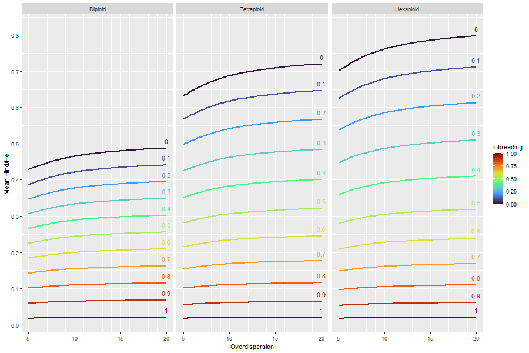

```{r setup, include=FALSE}
knitr::opts_chunk$set(echo = TRUE)
```

## When and why to use this pipeline

The variant and genotype calling pipeline described in this vignette is
intended for recent or ancient allopolyploid species, in which the reference
genome sequence contains many paralogous regions that do not recombine with
each other at meiosis.  In highly duplicated genomes such as these, conventional
alignment software, especially when restricted to only returning one alignment,
will often align sequences to the incorrect paralog, causing issues with variant
and genotype calling downstream.  The pipeline described in this vignette uses
read depth distribution across a population (the $H_{ind}/H_E$ statistic) to
determine whether a group of tags is behaving like a Mendelian locus. Attempting
to optimize this statistic, it rearranges tags among paralogous alignment locations
to correct alignments and generate well-behaved markers.

This pipeline is currently only designed for natural populations, diversity
panels, or mapping populations in which the most recent generation was produced
by random intermating among all progeny.  F1, self-fertilized, and backcrossed
populations will not be processed correctly because expected heterozygosity
cannot be estimated directly from allele frequencies in these populations.
However, the $H_{ind}/H_E$ statistic can still be used from within polyRAD
to filter non-Mendelian markers from these populations using the `HindHeMapping`
function.

If you use this pipeline, please cite:

Clark LV, Mays W, Lipka AE, and Sacks EJ (2020) A population-level statistic
for assessing Mendelian behavior of genotyping-by-sequencing data from highly
duplicated genomes.  *bioRxiv*
doi: [10.1101/2020.01.11.902890](https://doi.org/10.1101/2020.01.11.902890)

## Pipeline overview

Below is an overview of the pipeline.  It uses a combination of existing
bioinformatics tools, custom Python scripts included with polyRAD, and R
functions within polyRAD.

1. Use TASSEL-GBSv2 to find all unique sequence tags in a dataset, and the
depths of those tags in all taxa.
2. Align tags to the reference genome using Bowtie2, allowing multiple
alignments to be returned.
3. Use `process_sam_multi.py` to group tags based on sets of alignment
locations.
4. Import a small subset of the resulting data to polyRAD using
`readProcessSamMulti`.  Run `HindHe` on the imported data to identify
problematic samples and estimate inbreeding.
5. Use `process_isoloci.py` to sort tags into their correct alignment locations
within the groups of paralogs identified by `process_sam_multi.py`, and filter
out tags that cannot be adequately sorted.
6. Import the output of the previous step into polyRAD using
`readProcessIsoloci`, then perform genotype calling.

Everything except for the R portion of this pipeline will need to be run on your
operating system's Terminal/Shell/Command Prompt.  Bowtie2 requires Mac or
Linux.  Python 3 is needed for the Python portions of the pipeline.  If any of
this presents a barrier to you, I recommend finding someone experienced with
bioinformatics at your institution who can give you some advice.

Line breaks have been inserted in some terminal commands for readability in this
tutorial.  (Those same line breaks should not be typed at the command line.)

## TASSEL-GBSv2

An overview of the TASSEL-GBSv2 pipeline is available at
https://bitbucket.org/tasseladmin/tassel-5-source/wiki/Tassel5GBSv2Pipeline.
TASSEL can be downloaded from https://www.maizegenetics.net/tassel.

We will only run the first couple steps of the TASSEL-GBS pipeline.  The files
that you will need to start with are the
[key file](https://bitbucket.org/tasseladmin/tassel-5-source/wiki/Tassel5GBSv2Pipeline/KeyFileExample)
and your FASTQ files.

1. Run the [GBSSeqToTagDBPlugin](https://bitbucket.org/tasseladmin/tassel-5-source/wiki/Tassel5GBSv2Pipeline/GBSSeqToTagDBPlugin).
This requires your key file and FASTQ files as input, and will generate a
database file.
2. Run the [TagExportToFastqPlugin](https://bitbucket.org/tasseladmin/tassel-5-source/wiki/Tassel5GBSv2Pipeline/TagExportToFastqPlugin).
This requires your database file as input, and outputs a FASTQ with each tag
present once.  Set the `-c` parameter to something higher than the default
(10 is still pretty conservative but will discard most sequencing errors) to
save some processing downstream.
3. Run the [GetTagTaxaDistFromDBPlugin](https://bitbucket.org/tasseladmin/tassel-5-source/wiki/Tassel5GBSv2Pipeline/GetTagTaxaDistFromDBPlugin).  This requires the database as input, and outputs a tab-delimited
text file showing the depth of each tag in each sample.

The commands might look like (on Windows):

```
run_pipeline.bat -fork1 -GBSSeqToTagDBPlugin -e PstI-MspI -i D:\Msa\raw_data\
-db D:\Msa\Msa.db -k D:\Msa\key.txt -kmerLength 80 -endPlugin -runfork1

run_pipeline.bat -fork1 -TagExportToFastqPlugin -c 10 -db D:\Msa\Msa.db
-o D:\Msa\Msa_tags.fq -endPlugin -runfork1

run_pipeline.bat -fork1 -GetTagTaxaDistFromDBPlugin -db D:\Msa\Msa.db
-o D:\Msa\Msa_ttd.txt -endPlugin -runfork1
```

You may need to adjust the memory parameters to accomodate a large dataset.

### If TASSEL-GBS won't work for your dataset

If for some reason you can't use TASSEL-GBS (for example, your FASTQ files don't
have inline barcodes, or your protocol doesn't involve restriction enzymes) you
might be able to craft a custom alternative for yourself. What you will need out
of this step is a file formatted identically to a TagTaxaDist file from TASSEL,
and a FASTA or FASTQ file containing the same sequence tags as the
TagTaxaDist file.

A TagTaxaDist file is a tab-delimited text file formatted as below, and contains
the read depth of every tag in every sample (taxon).  I have used a simple
convention for sample names here, but the names can be anything you want.
Depending on the complexity of your dataset, it can be quite a large file.

| Tag | Sam1 | Sam2 | Sam3| Sam4 |
|-----|------|------|-----|------|
| TGCAGAAATCATAGATTAAGGATAT| 0 | 24 | 1 | 0 |
| TGCAGAACAGGATACGATACCCCTT| 2 | 0 | 0 | 0 |
| TGCAGAACAGTATACGATACCCCTT| 0 | 5 | 0 | 0 |

## Alignment with Bowtie2

Next, align the FASTQ file generated in step 2 of the previous section to your
reference genome.  If you have never used
[Bowtie2](http://bowtie-bio.sourceforge.net/bowtie2/index.shtml)
on your reference genome before, you will first need to
[make an index](http://bowtie-bio.sourceforge.net/bowtie2/manual.shtml#the-bowtie2-build-indexer).

```
bowtie2-build Msinensis_497_v7.0.hardmasked.fa Msi_DH1_7
```

Importantly, you will need to set the `-k` argument to something higher than the
number of subgenomes within your reference genome.  For example, in an
allotetraploid do at least `-k 3`, and in an allohexaploid at least `-k 4`.

For my *Miscanthus* dataset, I ran:

```
bowtie2 -k 3 --very-sensitive -x Msi_DH1_7 -U Msa_tags.fq -S Msa_align.sam
```

## Grouping tags by alignment sets

Next you will run `process_sam_multi.py`.  To locate this file, in R run

```{r}
system.file("python", "process_sam_multi.py", package = "polyRAD")
```

For convenience, you might copy this file to somewhere closer to your working
directory where you have the files generated in the previous step.  While you
are at it, also copy `isoloci_fun.py` and `process_isoloci.py` to somewhere
convenient.

As input, you will need the SAM file generated by Bowtie2 and the TagTaxaDist
file from TASSEL.  Be sure to set the `-g` argument to the number of subgenomes
if it is different from the default of 2 (allotetraploids); for example, in
an allohexaploid you should set `-g 3`.

For descriptions of other arguments, see

```
python process_sam_multi.py --help
```

The `-c` argument is useful if you want to divide your data into smaller chunks
for downstream processing (if you are limited on RAM or have many processors at
your disposal).  If there were some samples in your TASSEL database that you
already know you want to get rid of, you can list the samples that you want to
keep in a text file (one sample name per line) and pass that to the `-s`
argument.

In my *Miscanthus* data, the command looked like:

```
python process_sam_multi.py Msa_align.sam Msa_ttd.txt split_depths/Msa_split -c 5
```

The output will be a pair of CSVs for each chunk. One is named "align",
containing the set of alignment locations for each tag, with their respective
number of mutations and CIGAR strings.  The other, named "depth", is a subsetted
version of the TagTaxaDist file, containing the same tags in the same order as
"align".

## Filtering samples and estimating inbreeding

Before proceeding, we will want to get a look at the data to identify any
outlier samples that may be a different ploidy from the rest, interspecific
hybrids, or highly contaminated.  I recommend removing them to avoid biasing
$H_{ind}/H_E$ estimates, but keep in mind that this means they will be excluded
from all downstream analysis.  If a sample is important to your study and
you know of a reason why it would have a different heterozygosity from most
samples, you should keep it.

We will import just 1000 loci using `readProcessSamMulti`.  Sequence tags will
be assigned preliminary alignment locations based on where they had highest
sequence similarity, or to a random location if there was a tie.  This is
essentially a preview of what the data would look like if we went ahead with
variant calling using the top alignments returned by Bowtie2.

```{r}
library(polyRAD)
```
```{r eval = FALSE}
myRADprelim <- readProcessSamMulti("Msa_split_1_align.csv")
```

We will then estimate a $H_{ind}/H_E$ matrix for this data, as well as getting
a sum of the read depth for each individual.

```{r eval = FALSE, echo = FALSE}
# subset the object to have diploids and a few tetras
diploids <- readLines("diploids.txt")
myRADprelim <- SubsetByTaxon(myRADprelim, c(diploids, "KMS397", "KMS444", "UI11-00032"))
```
```{r eval = FALSE}
hh <- HindHe(myRADprelim)
TotDepthT <- rowSums(myRADprelim$locDepth)
```
```{r echo = FALSE}
load(system.file("extdata", "MsaHindHe.RData", package = "polyRAD"))
```

Now we will look at the distribution of $H_{ind}/H_E$ across samples, and
remove outlier samples.

```{r}
hhByInd <- rowMeans(hh, na.rm = TRUE)

plot(TotDepthT, hhByInd, xlog = TRUE,
     xlab = "Depth", ylab = "Hind/He", main = "Samples")
abline(h = 0.5, lty = 2)
```

For a diploid population, we aren't expecting values above 0.5.  (In general,
you shouldn't see values above $\frac{ploidy - 1}{ploidy}$.)  So, let's check
which are the outlier samples, then remove them from the dataset.

```{r}
threshold <- mean(hhByInd) + 3 * sd(hhByInd)
threshold

hhByInd[hhByInd > threshold]
hh <- hh[hhByInd <= threshold,]
```
```{r eval = FALSE}
myRADprelim <- SubsetByTaxon(myRADprelim, rownames(hh))
```

If you remove any samples like this, you should also make a text file indicating
samples to retain in the analysis, which we will use in the next Python step.

```{r eval = FALSE}
writeLines(rownames(hh), con = "samples.txt")
```

Now we can get a sense of what $H_{ind}/H_E$ looks like across loci.  From this
we can estimate inbreeding and get a rough sense of what proportion of loci
will need to be adjusted or filtered by `process_isoloci.py`.

```{r}
hhByLoc <- colMeans(hh, na.rm = TRUE)

hist(hhByLoc, breaks = 50, xlab = "Hind/He", main = "Loci", col = "lightgrey")
```

Again, we expect values below 0.5 (*i.e.* $\frac{ploidy - 1}{ploidy}$).  The
tail that we observe above that value likely represents groups of tags that
aligned to the same location but in fact represent paralogous loci.  The values
near zero likely represent loci with very high amplification bias or
overdispersion.  We will take the peak at 0.3 to represent typical well-behaved
markers.

To estimate inbreeding, we'll also need to estimate overdispersion.  You may
want to check a broader range of values than 8 to 10.

```{r eval = FALSE}
overdispersionP <- TestOverdispersion(myRADprelim, to_test = 8:10)
```

```{r echo = FALSE}
load(system.file("extdata", "MsaOverdispersion.RData", package = "polyRAD"))
```

```{r eval = requireNamespace("qqman", quietly = TRUE)}
qqman::qq(overdispersionP[["8"]])
qqman::qq(overdispersionP[["9"]])
qqman::qq(overdispersionP[["10"]])
```

If $H_{ind}/H_E$ is 0.3 and overdispersion is 9, we can estimate inbreeding
to be about 0.37 using the figure below, which was generated using
simulated data.



If all markers were Mendelian, we can see what the expected distribution of
$H_{ind}/H_E$ would look like, given the sample size and read depth distribution
observed in the dataset.

```{r eval = FALSE}
ExpectedHindHe(myRADprelim, inbreeding = 0.37, ploidy = 2)
```
```{r echo = FALSE}
message("Simulating rep 1")
message("Completed 5 simulation reps")
cat(c("Mean Hind/He: 0.307",
      "Standard deviation: 0.0879",
      "95% of observations are between 0.162 and 0.509"), sep = "\n")
load(system.file("extdata", "MsaHindHe3.RData", package = "polyRAD"))
hist(testhhdist, xlab = "Hind/He", main = "Expected distribution of Hind/He",
     breaks = 30)
```

## Sorting tags into isoloci and filtering isoloci

We are now ready to run the script `process_isoloci.py`.  It will be run
individually on each pair of "align" and "depth" files generated by
`process_sam_multi.py`.  Note that `isoloci_fun.py` must be present in the same
directory as `process_isoloci.py`.  We'll use an expected $H_{ind}/H_E$ of
0.3 and a maximum of 0.5, rounded from the output of `ExpectedHindHe` above.

```
python process_isoloci.py split_depths/Msa_split_1_align.csv
split_depths/Msa_split_1_depth.csv -e 0.3 -m 0.5 -s samples.txt
```

This will take some time to process, and will output a file called
`Msa_split_1_sorted.csv` in the `split_depths` folder.  This file will contain
corrected alignment results, tag sequences, position and sequence for the
variable portion of the tag with respect to the reference genome, and depth
data for all retained samples.  Tags are arranged into isoloci (*i.e.*
assigned to alignment locations) to optimize $H_{ind}/H_E$ first and number of
mutations from the genome second.  Isoloci are removed from the dataset if
they exceed the expected $H_{ind}/H_E$ by a certain amount (essentially, if
it is closer to what would be expected for double the ploidy than for the
input ploidy).

## Genotype calling

We can now import the sorted dataset into polyRAD.  Since there is a small
number of individuals in this dataset, we will lower the filtering thresholds
for loci we import.  The `possiblePloidies` argument is left at the default of
`2` because although the species is allotetraploid, the sorted loci should now
behave in a diploid fashion.

```{r eval = FALSE}
myRAD <- readProcessIsoloci("Msa_split_1_sorted.csv", min.ind.with.reads = 80,
                            min.ind.with.minor.allele = 5)
```

We can see what the distribution of $H_{ind}/H_E$ looks like after we have
sorted and filtered isoloci.

```{r eval = FALSE}
hh2 <- HindHe(myRAD)
hh2ByInd <- rowMeans(hh2, na.rm = TRUE)
hh2ByLoc <- colMeans(hh2, na.rm = TRUE)
```
```{r echo = FALSE}
load(system.file("extdata", "MsaHindHe2.RData", package = "polyRAD"))
```

```{r}
hist(hh2ByInd, xlab = "Hind/He", main = "Samples", breaks = 20, col = "lightgrey")
hist(hh2ByLoc, xlab = "Hind/He", main = "Loci", breaks = 50, col = "lightgrey")
```

By default, `readProcessIsoloci` runs `MergeRareHaplotypes` internally.  (This
behavior can be turned off with `mergeRareHap = FALSE`.)  Those
loci that now appear to have a very inflated $H_{ind}/H_E$ are ones where all
true minor alleles were rare enough to be merged into the common allele, and
any remaining minor alleles only represent sequencing error or alleles that were
amplified very poorly.  We can get rid of these.

```{r}
mean(hh2ByLoc <= 0.5) # proportion of loci retained
keeploci <- names(hh2ByLoc)[hh2ByLoc <= 0.5]
head(keeploci)
hist(hh2ByLoc[keeploci], xlab = "Hind/He", main = "Loci", breaks = 50, col = "lightgrey")
```
```{r eval = FALSE}
myRAD <- SubsetByLocus(myRAD, keeploci)
```

Genotype calling can then be performed as normal.

```{r eval = FALSE}
myRAD <- IteratePopStruct(myRAD)
```

If you want genotypes output as traditional SNP markers, you can use the
`RADdata2VCF` function.

```{r eval = FALSE}
RADdata2VCF(myRAD, file = "Msa_test.vcf")
```

