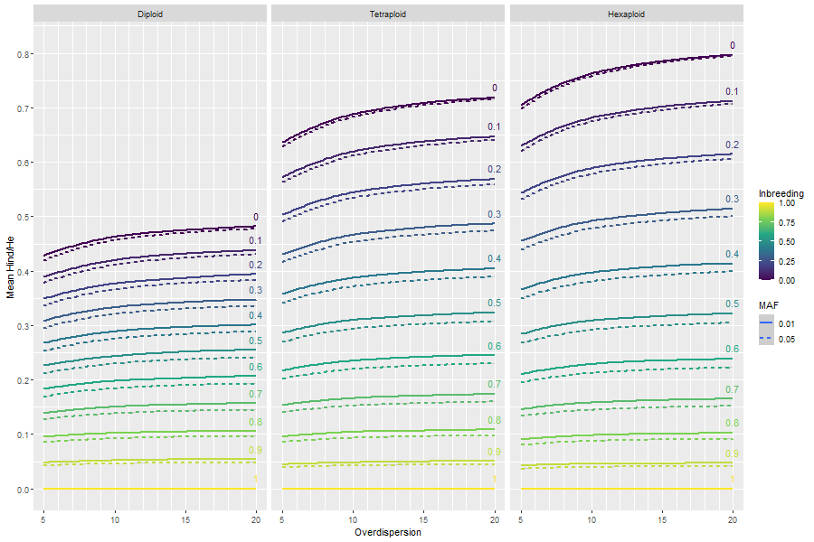

```{r setup, include=FALSE}
knitr::opts_chunk$set(echo = TRUE, fig.width = 6, fig.height = 6)
```

## Introduction <a name="introduction"></a>

polyRAD is an R package that assists with genotype calling from DNA sequence
datasets such as genotyping-by-sequencing (GBS) or restriction site-associated
DNA sequencing (RAD) in polyploids and diploids.  Genotype likelihoods are 
estimated from allelic read
depth, genotype prior probabilities are estimated from population parameters,
and then genotype posterior probabilities are estimated from likelihoods and
prior probabilities.  Posterior probabilities can be used directly in 
downstream analysis, converted to posterior mean genotypes for analyses
of additive genetic effects, or used for export of the most probable genotypes
for analyses that require discrete genotypic data.

Analyses in polyRAD center around objects of an S3 class called `RADdata`.
A single `RADdata` object contains the entire dataset of read depth and 
locus information, as well as parameters that are estimated during the
course of analysis.

## Summary of available functions <a name="functions"></a>

For any function named in this section, see its help page for more information.
(For example by typing `?VCF2RADdata` into the R console.)

Several functions are available for import of read depth data and (optionally)
alignment information into a RADdata object:

* `VCF2RADdata`
* `readTagDigger`
* `readStacks`
* `readHMC`
* `readTASSELGBSv2`
* `readProcessSamMulti`
* `readProcessIsoloci`

More generally, the `RADdata` function is used for constructing RADdata
objects; see the help page for that function for more information on what 
data are needed.

Several pipelines are available for genotype estimation, depending on how the 
population is structured (i.e. what the genotype prior probabilities should be):

* `PipelineMapping2Parents`
* `IterateHWE`
* `IterateHWE_LD`
* `IteratePopStruct`
* `IteratePopStructLD`

For exporting the estimated genotypes to other software:

* `ExportGAPIT`
* `Export_rrBLUP_Amat`
* `Export_rrBLUP_GWAS`
* `Export_TASSEL_Numeric`
* `Export_polymapR`
* `Export_polymapR_probs`
* `Export_MAPpoly`
* `Export_GWASpoly`
* `Export_Structure`
* `Export_adegenet_genind`
* `RADdata2VCF`

If you need continuous numerical genotypes exported in some other format, see 
`GetWeightedMeanGenotypes`.  If you need discrete numerical genotypes, 
see `GetProbableGenotypes`.  Also, `GetLikelyGen` returns the 
most likely genotypes (based on read depth only) for a single sample.

There are also various utilities for manipulating RADdata objects:

* `SubsetByTaxon`
* `SubsetByLocus`
* `SubsetByPloidy`
* `SplitByChromosome`
* `MergeRareHaplotypes`
* `MergeTaxaDepth`
* `RemoveMonomorphicLoci`
* `RemoveHighDepthLoci`
* `RemoveUngenotypedLoci`
* `EstimateContaminationRate`
* `StripDown`
* `LocusInfo`

For identifying problematic loci and individuals:

* `HindHe`
* `HindHeMapping`
* `ExpectedHindHe`
* `ExpectedHindHeMapping`
* `InbreedingFromHindHe`

See `?GetTaxa` for a list of accessor functions as well.

## Estimating genotype probabilities in a mapping population <a name="mapping"></a>

### Data import example with UNEAK

In this example, we'll import some data from an F1 mapping population
of *Miscanthus sinensis* that were output by the 
[UNEAK](https://doi.org/10.1371/journal.pgen.1003215) pipeline.
These data are from a study by Liu *et al.* 
(2015; [doi:10.1111/gcbb.12275](https://doi.org/10.1111/gcbb.12275);
data available at http://hdl.handle.net/2142/79522), and can be
found in the "extdata" folder of the polyRAD installation.
*Miscanthus* is an ancient tetraploid that has undergone diploidization.
Given the ability of the UNEAK pipeline to filter paralogs, we expect most
loci to behave in a diploid fashion, but some may behave in an allotetraploid
fashion.

We'll start by loading polyRAD and importing the data into a `RADdata`
object.  The `possiblePloidies` argument indicates the expected
inheritance modes: diploid (2) and allotetraploid (2 2).

With your own dataset, you will not need to use `system.file`.  Instead,
directly create a text string indicating the name of your file (and its 
location if it is not in the working directory.)

```{r}
library(polyRAD)
maphmcfile <- system.file("extdata", "ClareMap_HapMap.hmc.txt", 
                          package = "polyRAD")
maphmcfile

mydata <- readHMC(maphmcfile,
                  possiblePloidies = list(2, c(2, 2)))
mydata
```

We can view the imported taxa names (subsetted here for space).

```{r}
GetTaxa(mydata)[c(1:10,293:299)]
```

All names starting with "Map" are progeny.  "Kaskade-Justin" and
"Zebrinus-Justin" are the parents.  "IGR-2011-001", "p196-150A-c"",
and "p877-348-b" aren't part of the population, but were doubled
haploid lines that were used to screen for paralogous markers.  We can
tell polyRAD which taxa are the parents; since this is an F1 population
it doesn't matter which is "donor" and which is "recurrent".

```{r}
mydata <- SetDonorParent(mydata, "Kaskade-Justin")
mydata <- SetRecurrentParent(mydata, "Zebrinus-Justin")
```

The next thing we'll want to do is add our genomic alignment data.  For this
dataset, we have alignment data stored in a CSV file, also in the "extdata"
directory of the polyRAD installation.  We'll add it to the `locTable`
slot of our `RADdata` object.  Be sure to name the new columns
"Chr" and "Pos".

```{r}
alignfile <- system.file("extdata", "ClareMap_alignments.csv", 
                         package = "polyRAD")

aligndata <- read.csv(alignfile, row.names = 1)
head(aligndata)

mydata$locTable$Chr <- aligndata[GetLoci(mydata), 1]
mydata$locTable$Pos <- aligndata[GetLoci(mydata), 2]
head(mydata$locTable)
```

If you don't have alignment data in your own dataset, you can still use
the pipeline described here.  Just set `useLinkage = FALSE` in 
the code below.  The advantage of including alignment data is that gentoypes
at linked markers are used for imputing missing or correcting erroneous
genotypes.

### Quality control and genotype calling

It is important that the only individuals included in the analysis are those
that are truly part of the population.  Allele frequencies are used for 
inferring segregation pattern, and could be incorrect if many individuals are
included that are not part of the population.  Additionally, the genotype
priors will be incorrect for individuals that are not part of the population,
leading to incorrect genotypes.

At this point we would normally do

```{r eval = FALSE}
mydata <- AddPCA(mydata)
```

However, because a very small number of markers was used in this example
dataset, the PCA does not accurately reflect the relatedness of individuals.
Here I will load a PCA that was done with the full set of markers.

```{r}
load(system.file("extdata", "examplePCA.RData", package = "polyRAD"))
mydata$PCA <- examplePCA
```

Now a plot can be used for visualizing the relationship among taxa.

```{r}
plot(mydata)
```

Now we'll extract a subset of taxa that we actually want to analyze.
We can see from the plot that a fair number of them were the product of
self-fertilization of "Zebrinus-Justin" and should be eliminated.

```{r}
realprogeny <- GetTaxa(mydata)[mydata$PCA[,"PC1"] > -10 &
                                 mydata$PCA[,"PC1"] < 10]
# eliminate the one doubled haploid line in this group
realprogeny <- realprogeny[!realprogeny %in% c("IGR-2011-001", "p196-150A-c",
                                               "p877-348-b")]
# also retain parents
keeptaxa <- c(realprogeny, GetDonorParent(mydata), GetRecurrentParent(mydata))

mydata <- SubsetByTaxon(mydata, taxa = keeptaxa)
plot(mydata)
```

Now we can perform a preliminary run of the pipeline.  The
`allowedDeviation` argument indicates how different the apparent
allele frequency (based on read depth ratios) can be from an expected
allele frequency (determined based on ploidy and mapping population type) 
and still be classified as that allele frequency. The default settings assume an
F1 population, but the population type can be adjusted using the
`n.gen.backcrossing`, `n.gen.intermating`, and
`n.gen.selfing` arguments.  We'll also lower `minLikelihoodRatio` from the
default because one of the parents has many uncertain genotypes under the
tetraploid model (which was determined by exploration of the dataset outside
of this tutorial; many NA values were observed in `priorProb` under the 
default). Since this first run is for a rough estimate of
genotypes, we'll set `useLinkage = FALSE` to save a little computational time.

```{r}
mydata2 <- PipelineMapping2Parents(mydata, 
                                   freqAllowedDeviation = 0.06,
                                   useLinkage = FALSE,
                                   minLikelihoodRatio = 2)
```

We can use these preliminary estimates to determine whether we need to adjust
the overdispersion parameter.  Exactly how much does read depth distribution
deviate from what would be expected under binomial distibution?  The 
`TestOverdispersion` function will help us here.  We will use the `qqman`
package to visualize the results.

```{r message = FALSE, warning = FALSE, eval = requireNamespace("qqman", quietly = TRUE)}
library(qqman)
overdispersionP <- TestOverdispersion(mydata2, to_test = 6:10)
qq(overdispersionP[["6"]])
qq(overdispersionP[["7"]])
qq(overdispersionP[["8"]])
qq(overdispersionP[["9"]])
qq(overdispersionP[["10"]])
```

It looks like `9` follows the red line most closely, so we'll use that for the
overdispersion parameter.

Next we can check for markers that are behaving in a non-Mendelian fashion.
If we are expecting diploid segregation, all markers should show a
$H_{ind}/H_E$ value of 0.5 or less.  (For an autopolyploid, the expected value
is $\frac{ploidy - 1}{ploidy}$.)

```{r message = FALSE}
myhindhe <- HindHeMapping(mydata, ploidy = 2L)
hist(colMeans(myhindhe, na.rm = TRUE), col = "lightgrey",
     xlab = "Hind/He", main = "Histogram of Hind/He by locus")
```

How does this compare to the distribution that we might expect from this dataset
if all loci were Mendelian?  We will use `ExpectedHindHeMapping` with the
overdispersion parameter that we estimated above.  One your own dataset,
I recommend using the default value of `reps`.

```{r}
set.seed(720)
ExpectedHindHeMapping(mydata, ploidy = 2, overdispersion = 9, reps = 2)
```

Comparing the observed distribution to the expected distribution, we may want
to filter some markers.

```{r}
goodMarkers <- colnames(myhindhe)[which(colMeans(myhindhe, na.rm = TRUE) < 0.5 &
                                          colMeans(myhindhe, na.rm = TRUE) > 0.4)]
mydata <- SubsetByLocus(mydata, goodMarkers)
```

Now we can re-run the pipeline to properly call the
genotypes.

```{r}
mydata <- PipelineMapping2Parents(mydata, 
                                  freqAllowedDeviation = 0.06,
                                  useLinkage = TRUE, overdispersion = 9,
                                  minLikelihoodRatio = 2)
```

### Examining the output

We can examine the allele frequencies.
Allele frequencies that fall outside of the expected ranges will be 
recorded as they were estimated from read depth.  In this case most are within
the expected ranges.

```{r}
table(mydata$alleleFreq)
```

Genotype likelihood is also stored in the object for each possible
genotype at each locus, taxon, and ploidy.  This is the probability
of seeing the observed distribution of reads.

```{r}
mydata$alleleDepth[8,9:16]
mydata$genotypeLikelihood[[1]][,8,9:16]
mydata$genotypeLikelihood[[2]][,8,9:16]
```

Above, for one individal (Map1-018), we see its read depth at
eight alleles (four loci), followed by the genotype likelihoods
under diploid and tetraploid models.  For example, at locus TP35570, 
heterozygosity is the most likely state, although there is a chance that
this individual is homozygous for allele 0 and the four reads of allele 1
were due to contamination.  If this locus is allotetraploid, it is most
likely that there is one copy of allele 1 and three copies of allele 0.
Other loci have higher depth and as a result there is less uncertainty
in the genotype, particularly for the diploid model.

The prior genotype probabilities (expected genotype distributions) are also
stored in the object for each possible ploidy.  These distributions are estimated based
on the most likely parent genotypes.  Low confidence parent genotypes
can be ignored by increasing the `minLikelihoodRatio` argument to
`PipelineMapping2Parents`.

```{r}
mydata$priorProb[[1]][,9:16]
mydata$priorProb[[2]][,9:16]
```

Here we see some pretty big differences under the diploid and
allotetraploid models.  For example, if TP35570 is behaving in a diploid
fashion we expect F2-like segregation since both parents were 
heterozygous.  However, if TP35570 is behaving in an allotetraploid
fashion, a 1:1 segregation ratio is expected due to one parent being
heterozygous at one isolocus and the other being homozygous at both
isoloci.

Now we want to determine which ploidy is the best fit for each locus.
This is done by comparing genotype prior probabilities to
genotype likelihoods and estimating a $\chi^2$ statistic.  Lower
values indicate a better fit.

```{r}
mydata$ploidyChiSq[,9:16]
```

We can make a plot to get an overall sense of how well the markers
fit the diploid versus tetraploid model.

```{r}
plot(mydata$ploidyChiSq[1,], mydata$ploidyChiSq[2,], 
     xlab = "Chi-squared for diploid model",
     ylab = "Chi-squared for tetraploid model")
```

For each allele, whichever model gives the lower Chi-squared value is the one
with the best fit.  In this case it
looks like everything is diploid with fairly high confidence, in agreement with
our $H_{ind}/H_E$ results.

Now we'll examine the posterior genotype probabilities.  These are still
estimated separately for each ploidy.

```{r}
mydata$posteriorProb[[1]][,10,9:16]
mydata$posteriorProb[[2]][,10,9:16]
```

### Results cleanup and export

Since we decided from the Chi-squared results that the markers were only
segregating in a diploid manner, we can remove allotetraploidy from the
dataset.

```{r}
mydata <- SubsetByPloidy(mydata, ploidies = list(2))
```

Typically in a mapping population, due to noisy data polyRAD will not be able
to determine the segregation patterns of some markers, which end up having `NA`
values for their prior and posterior probabilities.  There may also be some
cases where both parents were homozygous and as a result there is no 
segregation in an F1 population.  In this example dataset, these issues are not
present (as long as diploidy is assumed) because the markers were curated
from a set that had already been filtered for mapping.  Generally, however,
you would want to find and remove such markers using `RemoveUngenotypedLoci`:

```{r}
mydata <- RemoveUngenotypedLoci(mydata)
```

We can export the results for use in downstream analysis.  The function
below weights possible ploidies for each allele based on the results
in `mydata$ploidyChiSq`, and for each taxon outputs a continuous,
numerical genotype that is the mean of all possible genotypes weighted
by genotype posterior probabilities (*i.e.* the posterior mean genotype).
By default, one allele per locus
is discarded in order to avoid mathematical singularities in downstream
analysis.  The continuous genotypes also range from zero to one by default,
which can be changed with the `minval` and `maxval` arguments.

```{r}
mywm <- GetWeightedMeanGenotypes(mydata)
round(mywm[c(276, 277, 1:5), 10:13], 3)
```

Note that the parent posterior mean genotypes were estimated using 
gentoype likelihood only, ignoring the priors set for the progeny.  In 
some places they may not match the progeny genotypes, indicating a
likely error in parental genotype calling.  We can see the parental
genotypes that were used for estimating progeny priors using
`$likelyGeno_donor` and `$likelyGeno_recurrent`.

```{r}
mydata$likelyGeno_donor[,9:16]
mydata$likelyGeno_recurrent[,9:16]
```

## Estimating genotype probabilities in a diversity panel <a name="diversity"></a>

Pipelines in polyRAD for processing a diversity panel (i.e. a germplasm
collection, a set of samples collected in the wild, or a panel for
genome-wide association analysis or genomic prediction) use iterative
algorithms.  Essentially, allele frequencies are re-estimated with each
iteration until convergence is reached.

### Data import example with VCF

Here we'll import a RAD-seq dataset from a large collection of wild and
ornamental *Miscanthus* from Clark *et al.* (2014;
[doi:10.1093/aob/mcu084](http://hdl.handle.net/10.1093/aob/mcu084)).

Since the data are in VCF format, we will need the Bioconductor package
VariantAnnotation to load them.  See 
https://bioconductor.org/packages/release/bioc/html/VariantAnnotation.html
for installation instructions.

Again, with your own dataset you will not need to use `system.file` (see 
section on mapping populations).

```{r echo = FALSE}
# Determine if VariantAnnotation is installed, so we know whether to
# execute the rest of the vignette.
haveVA <- requireNamespace("VariantAnnotation", quietly = TRUE)
```

```{r message=FALSE, warning=FALSE, eval = haveVA}
library(VariantAnnotation)

myVCF <- system.file("extdata", "Msi01genes.vcf", package = "polyRAD")
```

For your own VCF files, you will want to compress and index them before
reading them.  This has already been done for the file supplied with
polyRAD, but here is how you would do it:

```{r eval=FALSE}
mybg <- bgzip(myVCF)
indexTabix(mybg, format = "vcf")
```

Now we can make our `RADdata` object.  Because this is a small example
dataset, we are setting `expectedLoci` and `expectedAlleles` to
very low values; in a real dataset they should reflect how much data you are
actually expecting.  It is best to slightly overestimate the number of expected
alleles and loci.

```{r eval = haveVA}
mydata <- VCF2RADdata(myVCF, possiblePloidies = list(2, c(2,2)),
                      expectedLoci = 100, expectedAlleles = 500)
mydata
```

```{r echo = FALSE, eval = !haveVA}
# If we don't have VariantAnnotation, load in the dataset
load(system.file("extdata", "vcfdata.RData", package = "polyRAD"))
```

### Quality control and parameter estimation

For natural populations and diversity panels, we can run `TestOverdispersion`
before performing any genotype calling.

```{r eval = requireNamespace("qqman", quietly = TRUE)}
overdispersionP <- TestOverdispersion(mydata, to_test = 8:10)
qq(overdispersionP[["8"]])
qq(overdispersionP[["9"]])
qq(overdispersionP[["10"]])
```

As with the mapping population, nine looks like a good value.

Before we perform genotype calling, we can also test for Mendelian segregation at
each marker using the $H_{ind}/H_E$ statistic.

```{r}
myhindhe <- HindHe(mydata)
myhindheByLoc <- colMeans(myhindhe, na.rm = TRUE)
hist(myhindheByLoc, col = "lightgrey",
     xlab = "Hind/He", main = "Histogram of Hind/He by locus")
abline(v = 0.5, col = "blue", lwd = 2)
```

The peak below 0.5 indicates well-behaved diploid loci.  In a typical dataset
with more markers, you can get more resolution on the histogram (see the `breaks`
argument of `hist`), but let's say the peak is at 0.35. The graph below can be
used to estimate inbreeding from $H_{ind}/H_E$ and overdispersion.  For
a diploid with overdispersion of 9 and $H_{ind}/H_E$ of 0.35, inbreeding is
about 0.25.



There is also the `InbreedingFromHindHe` function for estimating inbreeding,
but it is from an older version of polyRAD and does not account for
overdispersion, leading to overestimates of inbreeding.

With overdispersion and inbreeding estimated,
we can simulate what the $H_{ind}/H_E$ distribution might look like
if the dataset consisted entirely of Mendelian diploid loci with
no other technical issues.  Here `reps` is set to 10 because
of the size of the dataset and the need for a short run time, but in your own
data is is probably best to leave it at the default.  You do not need to use
`set.seed` unless you are trying to reproduce this vignette exactly.

```{r}
set.seed(803)
ExpectedHindHe(mydata, inbreeding = 0.25, ploidy = 2, overdispersion = 9,
               reps = 10)
```

According to these results, good quality markers can be expected to have
$H_{ind}/H_E$ values from about 0.25 to 0.44.  Values lower than that
indicate techical problems such as restriction cut site polymorphisms,
causing overdispersion in the data that could reduce genotyping quality.
Values higher than that indicate paralogy or higher ploidy than expected.
Since we are allowing for allotetraploidy in our genotype calling, we'll 
only remove markers where $H_{ind}/H_E$ is too low (although you may
consider filtering differently in your own dataset).

```{r}
mean(myhindheByLoc < 0.25) # about 33% of markers would be removed
keeploci <- names(myhindheByLoc)[myhindheByLoc >= 0.25]
mydata <- SubsetByLocus(mydata, keeploci)
```


### Genotype calling

We can iteratively estimate genotype probabilities assuming 
Hardy-Weinberg equilibrium.  The argument `tol` is set to a higher
value than the default here in order to help the tutorial run more quickly.
Since *Miscanthus* is highly outcrossing, we will leave the `selfing.rate`
argument at its default of zero.

```{r message = FALSE}
mydataHWE <- IterateHWE(mydata, tol = 1e-3, overdispersion = 9)
```

Let's take a look at allele frequencies:

```{r}
hist(mydataHWE$alleleFreq, breaks = 20, col = "lightgrey")
```

We can do a different genotype probability estimation that models population
structure and variation in allele frequencies among populations.  We don't
need to specify populations, since principal components analysis is used to
assess population structure assuming an isolation-by-distance model, with
gradients of gene flow across many groups of individuals.  This dataset 
includes a very broad sampling of *Miscanthus* across Asia, so it
is very appropriate to model population structure in this case.

For this example, since random number generation is used internally by
`IteratePopStruct` for probabalistic principal components analysis, I am
setting a seed so that the vignette always renders in the same way.

```{r message = FALSE}
set.seed(3908)
mydataPopStruct <- IteratePopStruct(mydata, nPcsInit = 8, tol = 5e-03,
                                    overdispersion = 9)
```

Allele frequency estimates have changed slightly:

```{r}
hist(mydataPopStruct$alleleFreq, breaks = 20, col = "lightgrey")
```

Here's some of the population structure that was used for modeling
allele frequencies (fairly weak in this case because so few markers
were used):

```{r}
plot(mydataPopStruct)
```

And here's an example of allele frequency varying across the environment.
Allele frequencies were estimated for each taxon, and are stored in the
`$alleleFreqByTaxa` slot.  In the plot below, color indicates estimated local
allele frequency.

```{r}
myallele <- 1
freqcol <- heat.colors(101)[round(mydataPopStruct$alleleFreqByTaxa[,myallele] * 100) + 1]
plot(mydataPopStruct, pch = 21, bg = freqcol)
```

### Examining inheritance mode

Let's examine the inheritance mode of the markers again now that we have run
the pipeline.

```{r}
plot(mydataPopStruct$ploidyChiSq[1,], mydataPopStruct$ploidyChiSq[2,], 
     xlab = "Chi-squared for diploid model",
     ylab = "Chi-squared for allotetraploid model", log = "xy")
abline(a = 0, b = 1, col = "blue", lwd = 2)
```

It seems that some markers look allotetraploid, and others look diploid.  We can
see if this matches $H_{ind}/H_E$ results.

```{r message = FALSE, eval = requireNamespace("ggplot2", quietly = TRUE)}
myChiSqRat <- mydataPopStruct$ploidyChiSq[1,] / mydataPopStruct$ploidyChiSq[2,]
myChiSqRat <- tapply(myChiSqRat, mydataPopStruct$alleles2loc, mean)
allelesPerLoc <- as.vector(table(mydataPopStruct$alleles2loc))

library(ggplot2)
ggplot(mapping = aes(x = myhindheByLoc[GetLoci(mydata)], y = myChiSqRat, fill = as.factor(allelesPerLoc))) +
  geom_point(shape = 21, size = 3) +
  labs(x = "Hind/He", y = "Ratio of Chi-squared values, diploid to allotetraploid",
       fill = "Alleles per locus") +
  geom_hline(yintercept = 1) +
  geom_vline(xintercept = 0.5) +
  scale_fill_brewer(palette = "YlOrRd")
```

Markers that fall in (or near) the lower-left quadrent are probably well-behaved
diploid markers, but others might represent merged paralogs.

As before, we can export the posterior mean genotypes for downstream analysis.

```{r}
wmgenoPopStruct <- GetWeightedMeanGenotypes(mydataPopStruct)
wmgenoPopStruct[1:10,1:5]
```

### Other genotype calling functions

If you expect that your species has high linkage disequilibrium, the functions
`IterateHWE_LD` and `IteratePopStructLD` behave like 
`IterateHWE` and `IteratePopStruct`, respectively, but also
update priors based on genotypes at linked loci.

## $H_{ind}/H_E$ for filtering markers and individuals <a name="hindhe"></a>

GBS/RAD data are inherently messy.  Some markers may behave in a non-Mendelian
fashion due to misalignments, amplification bias, presence-absence variation,
or other issues.  In addition to filtering out problematic markers, you may also
want to confirm that all individuals in the dataset are well-behaved.

The $H_{ind}/H_E$ statistic
([Clark et al. 2020](https://doi.org/10.1101/2020.01.11.902890)) helps to
filter such markers and individuals.  In a mapping population it can be run
using the `HindHeMapping` function, which requires a single ploidy to be input,
along with the mapping population design.  In a natural population or diversity
panel, the `HindHe` function can be used.  `HindHe` should also be used for
mapping populations in which the most recent generation was created by
random intermating among all progeny.  In all cases, I recommend running
`HindHe` or `HindHeMapping` before running `TestOverdispersion` or any of the
genotype calling functions, as demonstrated in the previous sections.

Below we'll work with a dataset from *Miscanthus sacchariflorus*, including 635
individuals and 5182 loci
([Clark et al. 2018](https://doi.org/10.1093/aob/mcy161)).  The `RADdata` object
is not provided here due to size, but the following objects were created from it:

```{r eval = FALSE}
myHindHe <- HindHe(mydata)
TotDepthT <- rowSums(mydata$locDepth)
```

We will load these:

```{r}
print(load(system.file("extdata", "MsaHindHe0.RData", package = "polyRAD")))
```

This additionally provides a vector called `ploidies` indicating the ploidy of
each individual, determined primarily by flow cytometry.  `myHindHe` is a matrix
with one value per individual*locus, and `TotDepthT` is a vector showing the
total read depth at each locus.

To investigate individuals, we can take the row means of the matrix:

```{r}
myHindHeByInd <- rowMeans(myHindHe, na.rm = TRUE)
```

Then we can plot these versus depth for each ploidy.

```{r eval = requireNamespace("ggplot2", quietly = TRUE)}
ggplot(data.frame(Depth = TotDepthT, HindHe = myHindHeByInd,
                  Ploidy = ploidies),
  mapping = aes(x = Depth, y = HindHe, color = Ploidy)) +
  geom_point() +
  scale_x_log10() +
  facet_wrap(~ Ploidy) +
  geom_hline(data = data.frame(Ploidy = c("2x", "3x", "4x"),
                               ExpHindHe = c(1/2, 2/3, 3/4)),
             mapping = aes(yintercept = ExpHindHe), lty = 2) +
  labs(x = "Read Depth", y = "Hind/He", color = "Ploidy")
```

Dashed lines indicate the expected value under Hardy-Weinberg Equilibrium.
This is $\frac{ploidy - 1}{ploidy}$, *e.g.* 0.5 for diploids and 0.75 for
tetraploids.
Since there is some population structure, most individuals show a lower value.
However, some interspecific hybrids have values higher than expected.  We can
also see that it is fairly easy to distinguish diploids and tetraploids.  This
method is not a replacement for flow cytometry, but can complement it if some
minority of samples in the dataset have unknown ploidy.

Let's divide the $H_{ind}/H_E$ results into those for diploids vs. tetraploids.

```{r}
myHindHe2x <- myHindHe[ploidies == "2x",]
myHindHe4x <- myHindHe[ploidies == "4x",]
```

Now we can look a the distribution of values across markers.

```{r}
myHindHeByLoc2x <- colMeans(myHindHe2x, na.rm = TRUE)
hist(myHindHeByLoc2x, breaks = 50, xlab = "Hind/He",
     main = "Distribution of Hind/He among loci in diploids",
     col = "lightgrey")
abline(v = 0.5, col = "blue", lwd = 2)

myHindHeByLoc4x <- colMeans(myHindHe4x, na.rm = TRUE)
hist(myHindHeByLoc4x, breaks = 50, xlab = "Hind/He",
     main = "Distribution of Hind/He among loci in tetraploids",
     col = "lightgrey")
abline(v = 0.75, col = "blue", lwd = 2)
```

Most loci look good, but those to the right of the blue line should probably be
filtered from the dataset.

```{r}
goodLoci <- colnames(myHindHe)[myHindHeByLoc2x < 0.5 & myHindHeByLoc4x < 0.75]
length(goodLoci) # 3233 out of 5182 markers retained
head(goodLoci)
```

The `goodLoci` vector that we created here could then be used by `SubsetByLocus`
to filter the dataset.  Remember that you would also want to use `SubsetByTaxon`
in this case to make sure that each `RADdata` object was uniform ploidy across
individuals.  The `ExpectedHindHe` function can also help with determining a
good cutoff for filtering markers.

## Considerations for RAM and processing time <a name="considerations"></a>

`RADdata` objects contain large matrices and arrays for storing read depth
and the parameters that are estimated by the pipeline functions, and as a 
result require a lot of RAM (computer memory) in comparison to
the posterior mean genotypes that are exported.
A `RADdata` object that has just been imported will take up less RAM than one
that has been processed by a pipeline function.  `RADdata` objects will also
take up more RAM (and take longer for pipeline functions to process) if they
have more possible ploidies and/or higher ploidies.

If you have hundreds of thousands, or possibly even tens of thousands, of
markers in your dataset, it may be too large to process as one object
on a typical computer.  In that case, I recommend using the
`SplitByChromosome` function immediately after import.  This function
will create separate `RADdata` objects by chromosomes or groups of
chromosomes, and will save those objects to separate R workspace (.RData)
files on your hard drive.  You can then run a loop to re-import those 
objects one at a time, process each one with a pipeline function, and export
posterior mean geneotypes (or any other parameters you wish to keep) to a
file or a smaller R object.  If you have access to a high performance 
computing cluster, you may instead wish to process individual chromosomes
as parallel jobs.

If you don't have alignment positions for your markers, or if you want to
divide them up some other way than by chromosome, see `SubsetByLocus`.
If you are importing from VCF but don't want to import the whole genome at
once, see the examples on the help page for `VCF2RADdata` for how to
import just a particular genomic region.

You might use `SubsetByLocus` and select a random subset of ~1000 loci to use
with `TestOverdispersion` for estimating the overdispersion parameter.

If you are using one of the iterative pipelines, it is possible to set the
`tol` argument higher in order to reduce processing time at the
expense of accuracy.

After you have run a pipeline, if you want to keep the `RADdata` object
but discard any components that are not needed for genotype export, you
can use the `StripDown` function.

Below is an example script showing how I processed a real dataset with
hundreds of thousands of SNPs.  Note that the (very large) VCF files are not
included with the polyRAD installation.

```{r eval = FALSE}
library(polyRAD)
library(VariantAnnotation)

# Two files produced by the TASSEL-GBSv2 pipeline using two different
# enzyme systems.
NsiI_file <- "170705Msi_NsiI_genotypes.vcf.bgz"
PstI_file <- "170608Msi_PstI_genotypes.vcf.bgz"

# The vector allSam was defined outside of this script, and contains the 
# names of all samples that I wanted to import.  Below I find sample names
# within the VCF files that match those samples.
NsiI_sam <- allSam[allSam %in% samples(scanVcfHeader(NsiI_file))]
PstI_sam <- allSam[allSam %in% samples(scanVcfHeader(PstI_file))]

# Import two RADdata objects, assuming diploidy.  A large yield size was
# used due to the computer having 64 Gb RAM; on a typical laptop you
# would probably want to keep the default of 5000.
PstI_RAD <- VCF2RADdata(PstI_file, samples = PstI_sam, yieldSize = 5e4,
                        expectedAlleles = 1e6, expectedLoci = 2e5)
NsiI_RAD <- VCF2RADdata(NsiI_file, samples = NsiI_sam, yieldSize = 5e4,
                        expectedAlleles = 1e6, expectedLoci = 2e5)

# remove any loci duplicated across the two sets
nLoci(PstI_RAD)    # 116757
nLoci(NsiI_RAD)    # 187434
nAlleles(PstI_RAD) # 478210
nAlleles(NsiI_RAD) # 952511
NsiI_keeploci <- which(!GetLoci(NsiI_RAD) %in% GetLoci(PstI_RAD))
cat(nLoci(NsiI_RAD) - length(NsiI_keeploci), 
    file = "180522Num_duplicate_loci.txt") #992 duplicate
NsiI_RAD <- SubsetByLocus(NsiI_RAD, NsiI_keeploci)

# combine allele depth into one matrix
PstI_depth <- PstI_RAD$alleleDepth
NsiI_depth <- NsiI_RAD$alleleDepth
total_depth <- matrix(0L, nrow = length(allSam), 
                      ncol = ncol(PstI_depth) + ncol(NsiI_depth),
                      dimnames = list(allSam, 
                                      c(colnames(PstI_depth), 
                                        colnames(NsiI_depth))))
total_depth[,colnames(PstI_depth)] <- PstI_depth[allSam,]
total_depth[rownames(NsiI_depth),colnames(NsiI_depth)] <- NsiI_depth

# combine other slots
total_alleles2loc <- c(PstI_RAD$alleles2loc, 
                       NsiI_RAD$alleles2loc + nLoci(PstI_RAD))
total_locTable <- rbind(PstI_RAD$locTable, NsiI_RAD$locTable)
total_alleleNucleotides <- c(PstI_RAD$alleleNucleotides, 
                             NsiI_RAD$alleleNucleotides)

# build new RADdata object and save
total_RAD <- RADdata(total_depth, total_alleles2loc, total_locTable,
                     list(2L), 0.001, total_alleleNucleotides)
#save(total_RAD, file = "180524_RADdata_NsiIPstI.RData")

# Make groups representing pairs of chromosomes, and one group for all 
# non-assembled scaffolds.
splitlist <- list(c("^01$", "^02$"),
                  c("^03$", "^04$"),
                  c("^05$", "^06$"),
                  c("^07$", "^08$"),
                  c("^09$", "^10$"),
                  c("^11$", "^12$"),
                  c("^13$", "^14$", "^15$"),
                  c("^16$", "^17$"),
                  c("^18$", "^194"), "^SCAFFOLD")
# split by chromosome and save seperate objects
SplitByChromosome(total_RAD, chromlist = splitlist, 
                  chromlist.use.regex = TRUE, fileprefix = "180524splitRAD")

# files with RADdata objects
splitfiles <- grep("^180524splitRAD", list.files("."), value = TRUE)

# list to hold markers formatted for GAPIT/FarmCPU
GAPITlist <- list()
length(GAPITlist) <- length(splitfiles)

# loop through RADdata objects
for(i in 1:length(splitfiles)){
  load(splitfiles[i])
  splitRADdata <- IteratePopStructLD(splitRADdata)
  GAPITlist[[i]] <- ExportGAPIT(splitRADdata)
}
#save(GAPITlist, file = "180524GAPITlist.RData")

# put together into one dataset for FarmCPU
GM.all <- rbind(GAPITlist[[1]]$GM, GAPITlist[[2]]$GM, GAPITlist[[3]]$GM,
                GAPITlist[[4]]$GM, GAPITlist[[5]]$GM, GAPITlist[[6]]$GM, 
                GAPITlist[[7]]$GM, GAPITlist[[8]]$GM,
                GAPITlist[[9]]$GM, GAPITlist[[10]]$GM)
GD.all <- cbind(GAPITlist[[1]]$GD, GAPITlist[[2]]$GD[,-1],
                GAPITlist[[3]]$GD[,-1], GAPITlist[[4]]$GD[,-1],
                GAPITlist[[5]]$GD[,-1], GAPITlist[[6]]$GD[,-1],
                GAPITlist[[7]]$GD[,-1], GAPITlist[[8]]$GD[,-1], 
                GAPITlist[[9]]$GD[,-1], GAPITlist[[10]]$GD[,-1])
#save(GD.all, GM.all, file = "180525GM_GD_all_polyRAD.RData") # 1076888 markers
```

## Citing polyRAD <a name="citation"></a>

Clark LV, Lipka AE, and Sacks EJ (2019) polyRAD: Genotype calling with
uncertainty from sequencing data in polyploids and diploids.  *G3* 9(3):663--673,
[10.1534/g3.118.200913](https://doi.org/10.1534/g3.118.200913).
