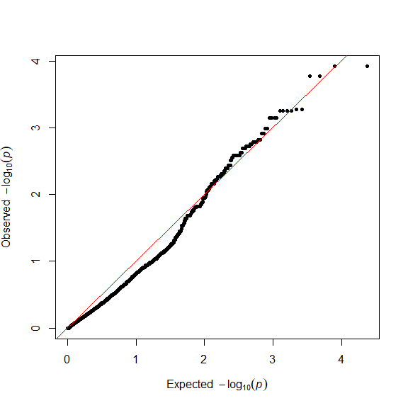
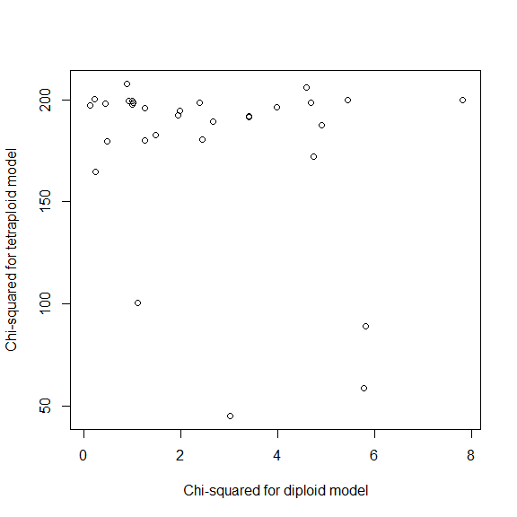
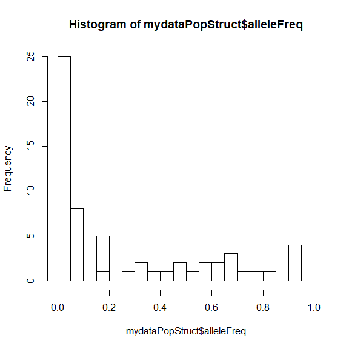
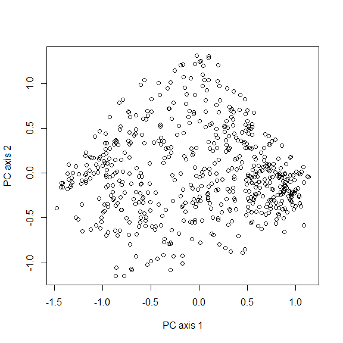
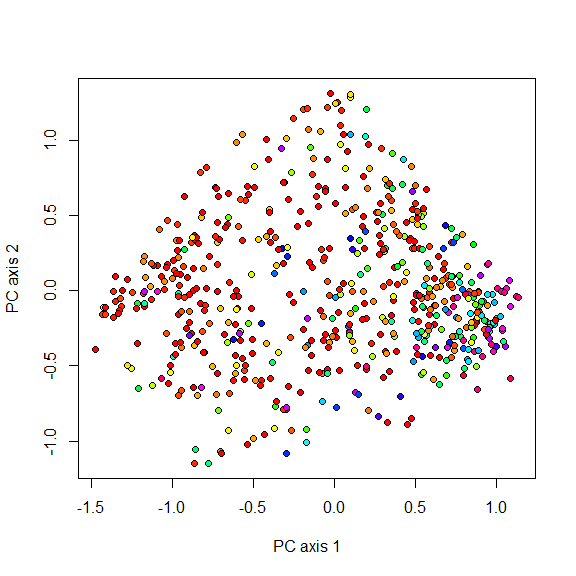

# polyRAD tutorial

## Table of Contents
* [Introduction](#introduction)
* [Summary of available functions](#functions)
* [Estimating genotype probabilities in a mapping population](#mapping)
* [Estimating genotype probabilities in a diversity panel](#diversity)
* [Considerations for RAM and processing time](#considerations)
* [Citing polyRAD](#citation)

## Introduction <a name="introduction"></a>

polyRAD is an R package that assists with genotype calling from DNA
sequence datasets such as genotyping-by-sequencing (GBS) or restriction
site-associated DNA sequencing (RAD) in polyploids and diploids.
Genotype likelihoods are estimated from allelic read depth, genotype
prior probabilities are estimated from population parameters, and then
genotype posterior probabilities are estimated from likelihoods and
prior probabilities. Posterior probabilities can be used directly in
downstream analysis, converted to weighted mean genotypes for analyses
of additive genetic effects, or used for export of the most probable
genotypes for analyses that require discrete genotypic data.

Analyses in polyRAD center around objects of an S3 class called
`RADdata`. A single `RADdata` object contains the entire dataset of read
depth and locus information, as well as parameters that are estimated
during the course of analysis.

## Summary of available functions <a name="functions"></a>

For any function named in this section, see its help page for more
information. (For example by typing `?VCF2RADdata` into the R console.)

Several functions are available for import of read depth data and
(optionally) alignment information into a RADdata object:

  - `VCF2RADdata`
  - `readTagDigger`
  - `readStacks`
  - `readHMC`
  - `readTASSELGBSv2`

More generally, the `RADdata` function is used for constructing RADdata
objects; see the help page for that function for more information on
what data are needed.

Several pipelines are available for genotype estimation, depending on
how the population is structured (i.e. what the genotype prior
probabilities should be.):

  - `PipelineMapping2Parents`
  - `IterateHWE`
  - `IterateHWE_LD`
  - `IteratePopStruct`
  - `IteratePopStructLD`

For exporting the estimated genotypes to other software:

  - `ExportGAPIT`
  - `Export_rrBLUP_Amat`
  - `Export_rrBLUP_GWAS`
  - `Export_TASSEL_Numeric`
  - `Export_polymapR`

If you need continuous numerical genotypes exported in some other
format, see `GetWeightedMeanGenotypes`. If you need discrete numerical
genotypes, see `GetProbableGenotypes`. Also, `GetLikelyGen` returns the
most likely genotypes (based on read depth only) for a single sample.

There are also various utilities for manipulating RADdata objects:

  - `SubsetByTaxon`
  - `SubsetByLocus`
  - `SplitByChromosome`
  - `MergeRareHaplotypes`
  - `RemoveMonomorphicLoci`
  - `EstimateContaminationRate`
  - `StripDown`
  - `LocusInfo`

See `?GetTaxa` for a list of accessor functions as
well.

## Estimating genotype probabilities in a mapping population <a name="mapping"></a>

In this example, we’ll import some data from an F1 mapping population of
*Miscanthus sinensis* that were output by the
[UNEAK](https://doi.org/10.1371/journal.pgen.1003215) pipeline. These
data are from a study by Liu *et al.* (2015;
[doi:10.1111/gcbb.12275](https://doi.org/10.1111/gcbb.12275); data
available at <http://hdl.handle.net/2142/79522>), and can be found in
the “extdata” folder of the polyRAD installation. *Miscanthus* is an
ancient tetraploid that has undergone diploidization. Given the ability
of the UNEAK pipeline to filter paralogs, we expect most loci to behave
in a diploid fashion, but some may behave in an allotetraploid fashion.

We’ll start by loading polyRAD and importing the data into a `RADdata`
object. The `possiblePloidies` argument indicates the expected
inheritance modes: diploid (2) and allotetraploid (2 2).

``` r
library(polyRAD)
maphmcfile <- system.file("extdata", "ClareMap_HapMap.hmc.txt", 
                          package = "polyRAD")

mydata <- readHMC(maphmcfile,
                  possiblePloidies = list(2, c(2, 2)))
mydata
```

    ## ## RADdata object ##
    ## 299 taxa and 50 loci
    ## 766014 total reads
    ## Assumed sample cross-contamination rate of 0.001
    ## 
    ## Possible ploidies:
    ## Autodiploid (2)
    ## Allotetraploid (2 2)

We can view the imported taxa names (subsetted here for space).

``` r
GetTaxa(mydata)[c(1:10,293:299)]
```

    ##  [1] "IGR-2011-001"    "Kaskade-Justin"  "Map1-001"       
    ##  [4] "Map1-002"        "Map1-003"        "Map1-005"       
    ##  [7] "Map1-008"        "Map1-011"        "Map1-016"       
    ## [10] "Map1-018"        "Map1-488"        "Map1-489"       
    ## [13] "Map1-490"        "Map1-491"        "Zebrinus-Justin"
    ## [16] "p196-150A-c"     "p877-348-b"

All names starting with “Map” are progeny. “Kaskade-Justin” and
“Zebrinus-Justin” are the parents. “IGR-2011-001”, “p196-150A-c”“,
and”p877-348-b" aren’t part of the population, but were doubled
haploid lines that were used to screen for paralogous markers. We can
tell polyRAD which taxa are the parents; since this is an F1 population
it doesn’t matter which is “donor” and which is “recurrent”.

``` r
mydata <- SetDonorParent(mydata, "Kaskade-Justin")
mydata <- SetRecurrentParent(mydata, "Zebrinus-Justin")
```

The next thing we’ll want to do is add our genomic alignment data. For
this dataset, we have alignment data stored in a CSV file, also in the
“extdata” directory of the polyRAD installation. We’ll add it to the
`locTable` slot of our `RADdata` object. Be sure to name the new columns
“Chr” and “Pos”.

``` r
alignfile <- system.file("extdata", "ClareMap_alignments.csv", 
                         package = "polyRAD")

aligndata <- read.csv(alignfile, row.names = 1)
head(aligndata)
```

    ##         Sorghum.LG Position.on.Sorghum.LG..bp.
    ## TP5489           1                     4560204
    ## TP13305          1                     4584260
    ## TP18261          1                     2911329
    ## TP18674          1                      387849
    ## TP19030          1                     7576879
    ## TP26698          1                     6972841

``` r
mydata$locTable$Chr <- aligndata[GetLoci(mydata), 1]
mydata$locTable$Pos <- aligndata[GetLoci(mydata), 2]
head(mydata$locTable)
```

    ##         Chr     Pos
    ## TP5489    1 4560204
    ## TP13305   1 4584260
    ## TP18261   1 2911329
    ## TP18674   1  387849
    ## TP19030   1 7576879
    ## TP26698   1 6972841

If you don’t have alignment data in your own dataset, you can still use
the pipeline described here. Just set `useLinkage = FALSE` in the code
below. The advantage of including alignment data is that gentoypes at
linked markers are used for imputing missing or correcting erroneous
genotypes.

Now we can run the pipeline. We’ll specify that we don’t want to include
the parents or doubled haploid lines in the estimation of allele
frequencies or evaluation of genotype frequenecies (`excludeTaxa`
argument). The `allowedDeviation` argument indicates how different the
apparent allele frequency (based on read depth ratios) can be from an
expected allele frequency (determined based on ploidy and mapping
population type) and still be classified as that allele frequency. The
default settings assume an F1 population, but the population type can be
adjusted using the `n.gen.backcrossing`, `n.gen.intermating`, and
`n.gen.selfing` arguments.

``` r
mydata <- PipelineMapping2Parents(mydata, 
                                  freqExcludeTaxa = c("Kaskade-Justin", 
                                                      "Zebrinus-Justin",
                                                     "IGR-2011-001",
                                                     "p196-150A-c", 
                                                     "p877-348-b"),
                                  freqAllowedDeviation = 0.06,
                                  useLinkage = TRUE)
```

    ## Making initial parameter estimates...

    ## Updating priors using linkage...

    ## Done.

We can examine the allele frequencies. Allele frequencies that fall
outside of the expected ranges will be recorded as they were estimated
from read depth.

``` r
table(mydata$alleleFreq)
```

    ## 
    ##             0.125 0.185006617653235              0.25             0.375 
    ##                 1                 1                41                 1 
    ##               0.5             0.625              0.75 0.814993382346765 
    ##                12                 1                41                 1 
    ##             0.875 
    ##                 1

Genotype likelihood is also stored in the object for each possible
genotype at each locus, taxon, and ploidy. This is the probability of
seeing the observed distribution of
    reads.

``` r
mydata$alleleDepth[3,11:20]
```

    ## TP26698_0 TP26698_1 TP28405_0 TP28405_1 TP28602_0 TP28602_1 TP28986_0 
    ##         1         7         0        51         0        32        15 
    ## TP28986_1 TP31810_0 TP31810_1 
    ##        21        10        13

``` r
mydata$genotypeLikelihood[[1]][,3,11:20]
```

    ##      TP26698_0    TP26698_1     TP28405_0     TP28405_1     TP28602_0
    ## 0 5.968571e-03 4.881592e-25  9.748162e-01 4.440892e-169  9.920309e-01
    ## 1 3.115636e-02 3.115636e-02  4.440892e-16  4.440892e-16  2.365849e-10
    ## 2 4.881592e-25 5.968571e-03 4.440892e-169  9.748162e-01 1.004524e-100
    ##       TP28602_1    TP28986_0    TP28986_1    TP31810_0    TP31810_1
    ## 0 1.004524e-100 5.158357e-45 1.309455e-56 1.087526e-30 2.697672e-35
    ## 1  2.365849e-10 8.126672e-02 8.126672e-02 1.365876e-01 1.365876e-01
    ## 2  9.920309e-01 1.309455e-56 5.158357e-45 2.697672e-35 1.087526e-30

``` r
mydata$genotypeLikelihood[[2]][,3,11:20]
```

    ##      TP26698_0    TP26698_1     TP28405_0     TP28405_1     TP28602_0
    ## 0 5.968571e-03 4.881592e-25  9.748162e-01 4.440892e-169  9.920309e-01
    ## 1 2.662559e-01 3.662109e-04  4.175805e-07  2.075288e-31  1.004524e-04
    ## 2 3.115636e-02 3.115636e-02  4.440892e-16  4.440892e-16  2.365849e-10
    ## 3 3.662109e-04 2.662559e-01  2.075288e-31  4.175805e-07  5.778929e-20
    ## 4 4.881592e-25 5.968571e-03 4.440892e-169  9.748162e-01 1.004524e-100
    ##       TP28602_1    TP28986_0    TP28986_1    TP31810_0    TP31810_1
    ## 0 1.004524e-100 5.158357e-45 1.309455e-56 1.087526e-30 2.697672e-35
    ## 1  5.778929e-20 1.233327e-02 1.746741e-05 2.592075e-02 9.787414e-04
    ## 2  2.365849e-10 8.126672e-02 8.126672e-02 1.365876e-01 1.365876e-01
    ## 3  1.004524e-04 1.746741e-05 1.233327e-02 9.787414e-04 2.592075e-02
    ## 4  9.920309e-01 1.309455e-56 5.158357e-45 2.697672e-35 1.087526e-30

Above, for one individal (Map1-001), we see its read depth at the first
ten alleles (first five loci), followed by the genotype likelihoods
under diploid and tetraploid models. For example, at locus TP26698,
heterozygosity is the most likely state, although there is a chance that
this individual is homozygous for allele 1 and the one read of allele 0
was due to contamination. If this locus is allotetraploid, it is most
likely that there is one copy of allele 0 and three copies of allele 1.
Other loci have higher depth and as a result there is less uncertainty
in the genotype, particularly for the diploid model.

The prior genotype probabilities (expected genotype distributions) are
also stored in the object for each possible ploidy. These distributions
are estimated based on the most likely parent genotypes. Low confidence
parent genotypes can be ignored by increasing the `minLikelihoodRatio`
argument to
    `PipelineMapping2Parents`.

``` r
mydata$priorProb[[1]][,11:20]
```

    ##   TP26698_0 TP26698_1 TP28405_0 TP28405_1 TP28602_0 TP28602_1 TP28986_0
    ## 0       0.0       0.5      0.25      0.25       0.5       0.0       0.5
    ## 1       0.5       0.5      0.50      0.50       0.5       0.5       0.5
    ## 2       0.5       0.0      0.25      0.25       0.0       0.5       0.0
    ##   TP28986_1 TP31810_0 TP31810_1
    ## 0       0.0       0.5       0.0
    ## 1       0.5       0.5       0.5
    ## 2       0.5       0.0       0.5

``` r
mydata$priorProb[[2]][,11:20]
```

    ##   TP26698_0 TP26698_1 TP28405_0 TP28405_1 TP28602_0 TP28602_1 TP28986_0
    ## 0       0.0       0.0         0         0         0         0        NA
    ## 1       0.0       0.5         0         0         1         0        NA
    ## 2       0.5       0.5         1         1         0         0        NA
    ## 3       0.5       0.0         0         0         0         1        NA
    ## 4       0.0       0.0         0         0         0         0        NA
    ##   TP28986_1 TP31810_0 TP31810_1
    ## 0        NA         0         0
    ## 1        NA         1         0
    ## 2        NA         0         0
    ## 3        NA         0         1
    ## 4        NA         0         0

Here we see some pretty big differences under the diploid and
allotetraploid models. For example, if TP28405 is behaving in a diploid
fashion we expect F2-like segregation since both parents were
heterozygous. However, if TP28405 is behaving in an allotetraploid
fashion, we expect that both parents are homozygous at differing
paralogous loci, resulting in no segregation.

Now we want to determine which ploidy is the best fit for each locus.
This is done by comparing genotype prior probabilities to genotype
likelihoods and estimating a \(\chi^2\) statistic. Lower values indicate
a better
    fit.

``` r
mydata$ploidyChiSq[,11:20]
```

    ##       TP26698_0  TP26698_1  TP28405_0  TP28405_1 TP28602_0 TP28602_1
    ## [1,]   6.156873   6.156873   7.390125   7.390125  17.60031  17.60031
    ## [2,] 130.424838 130.424838 178.066213 178.066213 230.45413 230.45413
    ##      TP28986_0 TP28986_1   TP31810_0   TP31810_1
    ## [1,]  2.107682  2.107682   0.1076233   0.1076233
    ## [2,]        NA        NA 238.0402426 238.0402426

We can make a plot to get an overall sense of how well the markers fit
the diploid versus tetraploid model.

``` r
plot(mydata$ploidyChiSq[1,], mydata$ploidyChiSq[2,], 
     xlab = "Chi-squared for diploid model",
     ylab = "Chi-squared for tetraploid model")
abline(a = 0, b = 1, col = "red")
```

<!-- -->

Alleles above the red line fit the diploid model better, and alleles
below the red line fit the tetraploid model better. In this case it
looks like everything is diploid with fairly high confidence.

Now we’ll examine the posterior genotype probabilities. These are still
estimated separately for each
    ploidy.

``` r
mydata$posteriorProb[[1]][,3,11:20]
```

    ##     TP26698_0   TP26698_1     TP28405_0     TP28405_1    TP28602_0
    ## 0 0.00000e+00 4.95033e-28  1.000000e+00 2.131711e-174 1.000000e+00
    ## 1 1.00000e+00 1.00000e+00  2.142491e-17  2.142491e-17 2.384855e-10
    ## 2 4.95033e-28 0.00000e+00 2.131711e-174  1.000000e+00 0.000000e+00
    ##      TP28602_1    TP28986_0    TP28986_1   TP31810_0   TP31810_1
    ## 0 0.000000e+00 1.287625e-40 0.000000e+00 7.96211e-30 0.00000e+00
    ## 1 2.384855e-10 1.000000e+00 1.000000e+00 1.00000e+00 1.00000e+00
    ## 2 1.000000e+00 0.000000e+00 1.287625e-40 0.00000e+00 7.96211e-30

``` r
mydata$posteriorProb[[2]][,3,11:20]
```

    ##    TP26698_0  TP26698_1 TP28405_0 TP28405_1 TP28602_0 TP28602_1 TP28986_0
    ## 0 0.00000000 0.00000000         0         0         0         0       NaN
    ## 1 0.00000000 0.01442306         0         0         1         0       NaN
    ## 2 0.98557694 0.98557694         1         1         0         0       NaN
    ## 3 0.01442306 0.00000000         0         0         0         1       NaN
    ## 4 0.00000000 0.00000000         0         0         0         0       NaN
    ##   TP28986_1 TP31810_0 TP31810_1
    ## 0       NaN         0         0
    ## 1       NaN         1         0
    ## 2       NaN         0         0
    ## 3       NaN         0         1
    ## 4       NaN         0         0

We can export the results for use in downstream analysis. The function
below weights possible ploidies for each allele based on the results in
`mydata$ploidyChiSq`, and for each taxon outputs a continuous, numerical
genotype that is the mean of all possible genotypes weighted by genotype
posterior probabilities. By default, one allele per locus is discarded
in order to avoid mathematical singularities in downstream analysis. The
continuous genotypes also range from zero to one by default, which can
be changed with the `minval` and `maxval` arguments.

``` r
mywm <- GetWeightedMeanGenotypes(mydata)
mywm[c(297,2:6), 6:10]
```

    ##                    TP26698_1  TP28405_1    TP28602_0    TP28986_0
    ## Zebrinus-Justin 5.110893e-01 0.50000014 2.485904e-18 3.232376e-39
    ## Kaskade-Justin  1.521187e-06 0.49989345 5.002103e-01 5.000000e-01
    ## Map1-001        4.998375e-01 0.98007584 1.773836e-02 5.000000e-01
    ## Map1-002        1.126958e-02 0.47687372 4.822616e-01 1.740322e-24
    ## Map1-003        1.126960e-02 0.03777935 1.773836e-02 5.000000e-01
    ## Map1-005        1.126958e-02 0.50000000 4.746178e-01 1.578666e-42
    ##                    TP31810_0
    ## Zebrinus-Justin 5.000000e-01
    ## Kaskade-Justin  1.583328e-20
    ## Map1-001        4.998870e-01
    ## Map1-002        1.129795e-04
    ## Map1-003        1.129795e-04
    ## Map1-005        4.998870e-01

Note that the parent weighted mean genotypes were estimated using
gentoype likelihood only, ignoring the priors set for the progeny. In
some places they may not match the progeny genotypes, indicating a
likely error in parental genotype calling. We can see the parental
genotypes that were used for estimating progeny priors using
`$likelyGeno_donor` and
    `$likelyGeno_recurrent`.

``` r
mydata$likelyGeno_donor[,11:20]
```

    ##   TP26698_0 TP26698_1 TP28405_0 TP28405_1 TP28602_0 TP28602_1 TP28986_0
    ## 2         2         0         1         1         1         1         1
    ## 4         4         0         2         2         2         2        NA
    ##   TP28986_1 TP31810_0 TP31810_1
    ## 2         1         0         2
    ## 4        NA         0         4

``` r
mydata$likelyGeno_recurrent[,11:20]
```

    ##   TP26698_0 TP26698_1 TP28405_0 TP28405_1 TP28602_0 TP28602_1 TP28986_0
    ## 2         1         1         1         1         0         2         0
    ## 4         1         3         2         2         0         4         0
    ##   TP28986_1 TP31810_0 TP31810_1
    ## 2         2         1         1
    ## 4         4         2         2

## Estimating genotype probabilities in a diversity panel <a name="diversity"></a>

Pipelines in polyRAD for processing a diversity panel (i.e. a germplasm
collection, a set of samples collected in the wild, or a panel for
genome-wide association analysis or genomic prediction) use iterative
algorithms. Essentially, allele frequencies are re-estimated with each
iteration until convergence is reached.

Here we’ll import a RAD-seq dataset from a large collection of wild and
ornamental *Miscanthus* from Clark *et al.* (2014;
[doi:10.1093/aob/mcu084](http://hdl.handle.net/10.1093/aob/mcu084)).

Since the data are in VCF format, we will need the Bioconductor package
VariantAnnotation to load them. See
<https://bioconductor.org/packages/release/bioc/html/VariantAnnotation.html>
for installation instructions.

``` r
library(VariantAnnotation)

myVCF <- system.file("extdata", "Msi01genes.vcf", package = "polyRAD")
```

For your own VCF files, you will want to compress and index them before
reading them. This has already been done for the file supplied with
polyRAD, but here is how you would do it:

``` r
mybg <- bgzip(myVCF)
indexTabix(mybg, format = "vcf")
```

Now we can make our `RADdata` object. Because this is a small example
dataset, we are setting `expectedLoci` and `expectedAlleles` to very low
values; in a real dataset they should reflect how much data you are
actually expecting. It is best to slightly overestimate the number of
expected alleles and loci.

``` r
mydata <- VCF2RADdata(myVCF, possiblePloidies = list(2, c(2,2)),
                      expectedLoci = 100, expectedAlleles = 500)
```

    ## Reading file...

    ## Unpacking data from VCF...

    ## Filtering markers...

    ## Phasing 55 SNPs on chromosome 01

    ## Reading file...

    ## 24 loci imported.

    ## Building RADdata object...

    ## Merging rare haplotypes...

``` r
mydata
```

    ## ## RADdata object ##
    ## 585 taxa and 24 loci
    ## 422433 total reads
    ## Assumed sample cross-contamination rate of 0.001
    ## 
    ## Possible ploidies:
    ## Autodiploid (2)
    ## Allotetraploid (2 2)

We can iteratively estimate genotype probabilities assuming
Hardy-Weinberg equilibrium. The argument `tol` is set to a higher value
than the default here in order to help the tutorial run more quickly.
Since *Miscanthus* is highly outcrossing, we will leave the
`selfing.rate` argument at its default of zero.

``` r
mydataHWE <- IterateHWE(mydata, tol = 1e-3)
```

Let’s take a look at allele frequencies:

``` r
hist(mydataHWE$alleleFreq, breaks = 20)
```

<!-- -->

We can do a different genotype probability estimation that models
population structure and variation in allele frequencies among
populations. We don’t need to specify populations, since principal
components analysis is used to assess population structure assuming an
isolation-by-distance model, with gradients of gene flow across many
groups of individuals. This dataset includes a very broad sampling of
*Miscanthus* across Asia, so it is very appropriate to model population
structure in this case.

For this example, since random number generation is used internally by
`IteratePopStruct` for probabalistic principal components analysis, I am
setting a seed so that the vignette always renders in the same way.

``` r
set.seed(3908)
mydataPopStruct <- IteratePopStruct(mydata, nPcsInit = 8, tol = 5e-03)
```

Allele frequency estimates have changed slightly:

``` r
hist(mydataPopStruct$alleleFreq, breaks = 20)
```

<!-- -->

Here’s some of the population structure that was used for modeling
allele frequencies (fairly weak in this case because so few markers were
used):

``` r
plot(mydataPopStruct$PCA[,1], mydataPopStruct$PCA[,2],
     xlab = "PC axis 1", ylab = "PC axis 2")
```

<!-- -->

And here’s an example of allele frequency varying across the
environment. Allele frequencies were estimated for each taxon, and are
stored in the `$alleleFreqByTaxa` slot. In the plot below, color
indicates estimated local allele frequency.

``` r
myallele <- 1
freqcol <- rainbow(101)[round(mydataPopStruct$alleleFreqByTaxa[,myallele] * 100) + 1]
plot(mydataPopStruct$PCA[,1], mydataPopStruct$PCA[,2],
     xlab = "PC axis 1", ylab = "PC axis 2", pch = 21,
     bg = freqcol)
```

<!-- -->

As before, we can export the weighted mean genotypes for downstream
analysis.

``` r
wmgenoPopStruct <- GetWeightedMeanGenotypes(mydataPopStruct)
wmgenoPopStruct[1:10,1:5]
```

    ##                       S01_138045_G S01_139820_TT S01_139820_CT
    ## KMS207-8              2.645137e-07   0.096667423    0.17087366
    ## JM0051.003            2.326726e-01   0.316595966    0.19777504
    ## JM0034.001            1.000000e-04   0.000100000    0.13146174
    ## JM0220.001            1.000000e-04   0.504460393    0.20460317
    ## NC-2010-003-001       2.993545e-01   0.000100000    0.05308058
    ## JM0026.001            1.449631e-01   0.000100000    0.18328813
    ## JM0026.002            8.935318e-03   0.080217548    0.21141645
    ## PI294605-US64-0007-01 1.982370e-08   0.005706146    0.04644102
    ## JM0058.001            6.938406e-01   0.000100000    0.22816820
    ## UI10-00086-Silberfeil 9.421438e-01   0.000100000    0.13270507
    ##                       S01_139883_G S01_150928_GG
    ## KMS207-8              7.826446e-02  1.247877e-13
    ## JM0051.003            9.579951e-03  9.156796e-08
    ## JM0034.001            3.502285e-03  9.399818e-06
    ## JM0220.001            1.549956e-01  9.224464e-10
    ## NC-2010-003-001       2.100899e-05  6.213912e-14
    ## JM0026.001            1.000000e-04  1.049680e-12
    ## JM0026.002            7.372525e-03  1.322674e-10
    ## PI294605-US64-0007-01 8.619531e-02  8.531214e-30
    ## JM0058.001            1.000000e-04  1.189512e-07
    ## UI10-00086-Silberfeil 2.108120e-03  3.147051e-30

If you expect that your species has high linkage disequilibrium, the
functions `IterateHWE_LD` and `IteratePopStructLD` behave like
`IterateHWE` and `IteratePopStruct`, respectively, but also update
priors based on genotypes at linked
loci.

## Considerations for RAM and processing time <a name="considerations"></a>

`RADdata` objects contain large matrices and arrays for storing read
depth and the parameters that are estimated by the pipeline functions,
and as a result require a lot of RAM (computer memory) in comparison to
the weighted mean genotypes that are exported. A `RADdata` object that
has just been imported will take up less RAM than one that has been
processed by a pipeline function. `RADdata` objects will also take up
more RAM (and take longer for pipeline functions to process) if they
have more possible ploidies and/or higher ploidies.

If you have hundreds of thousands, or possibly even tens of thousands,
of markers in your dataset, it may be too large to process as one object
on a typical computer. In that case, I recommend using the
`SplitByChromosome` function immediately after import. This function
will create separate `RADdata` objects by chromosomes or groups of
chromosomes, and will save those objects to separate R workspace
(.RData) files on your hard drive. You can then run a loop to re-import
those objects one at a time, process each one with a pipeline function,
and export weighted mean geneotypes (or any other parameters you wish to
keep) to a file or a smaller R object. If you have access to a high
performance computing cluster, you may instead wish to process
individual chromosomes as parallel jobs.

If you don’t have alignment positions for your markers, or if you want
to divide them up some other way than by chromosome, see
`SubsetByLocus`. If you are importing from VCF but don’t want to import
the whole genome at once, see the examples on the help page for
`VCF2RADdata` for how to import just a particular genomic region.

If you are using one of the iterative pipelines, it is possible to set
the `tol` argument higher in order to reduce processing time at the
expense of accuracy.

After you have run a pipeline, if you want to keep the `RADdata` object
but discard any components that are not needed for genotype export, you
can use the `StripDown` function.

Below is an example script showing how I processed a real dataset with
hundreds of thousands of SNPs. Note that the (very large) VCF files are
not included with the polyRAD installation.

``` r
library(polyRAD)
library(VariantAnnotation)

# Two files produced by the TASSEL-GBSv2 pipeline using two different
# enzyme systems.
NsiI_file <- "170705Msi_NsiI_genotypes.vcf.bgz"
PstI_file <- "170608Msi_PstI_genotypes.vcf.bgz"

# The vector allSam was defined outside of this script, and contains the 
# names of all samples that I wanted to import.  Below I find sample names
# within the VCF files that match those samples.
NsiI_sam <- allSam[allSam %in% samples(scanVcfHeader(NsiI_file))]
PstI_sam <- allSam[allSam %in% samples(scanVcfHeader(PstI_file))]

# Import two RADdata objects, assuming diploidy.  A large yield size was
# used due to the computer having 64 Gb RAM; on a typical laptop you
# would probably want to keep the default of 5000.
PstI_RAD <- VCF2RADdata(PstI_file, samples = PstI_sam, yieldSize = 5e4,
                        expectedAlleles = 1e6, expectedLoci = 2e5)
NsiI_RAD <- VCF2RADdata(NsiI_file, samples = NsiI_sam, yieldSize = 5e4,
                        expectedAlleles = 1e6, expectedLoci = 2e5)

# remove any loci duplicated across the two sets
nLoci(PstI_RAD)    # 116757
nLoci(NsiI_RAD)    # 187434
nAlleles(PstI_RAD) # 478210
nAlleles(NsiI_RAD) # 952511
NsiI_keeploci <- which(!GetLoci(NsiI_RAD) %in% GetLoci(PstI_RAD))
cat(nLoci(NsiI_RAD) - length(NsiI_keeploci), 
    file = "180522Num_duplicate_loci.txt") #992 duplicate
NsiI_RAD <- SubsetByLocus(NsiI_RAD, NsiI_keeploci)

# combine allele depth into one matrix
PstI_depth <- PstI_RAD$alleleDepth
NsiI_depth <- NsiI_RAD$alleleDepth
total_depth <- matrix(0L, nrow = length(allSam), 
                      ncol = ncol(PstI_depth) + ncol(NsiI_depth),
                      dimnames = list(allSam, 
                                      c(colnames(PstI_depth), 
                                        colnames(NsiI_depth))))
total_depth[,colnames(PstI_depth)] <- PstI_depth[allSam,]
total_depth[rownames(NsiI_depth),colnames(NsiI_depth)] <- NsiI_depth

# combine other slots
total_alleles2loc <- c(PstI_RAD$alleles2loc, 
                       NsiI_RAD$alleles2loc + nLoci(PstI_RAD))
total_locTable <- rbind(PstI_RAD$locTable, NsiI_RAD$locTable)
total_alleleNucleotides <- c(PstI_RAD$alleleNucleotides, 
                             NsiI_RAD$alleleNucleotides)

# build new RADdata object and save
total_RAD <- RADdata(total_depth, total_alleles2loc, total_locTable,
                     list(2L), 0.001, total_alleleNucleotides)
#save(total_RAD, file = "180524_RADdata_NsiIPstI.RData")

# Make groups representing pairs of chromosomes, and one group for all 
# non-assembled scaffolds.
splitlist <- list(c("^01$", "^02$"),
                  c("^03$", "^04$"),
                  c("^05$", "^06$"),
                  c("^07$", "^08$"),
                  c("^09$", "^10$"),
                  c("^11$", "^12$"),
                  c("^13$", "^14$", "^15$"),
                  c("^16$", "^17$"),
                  c("^18$", "^194"), "^SCAFFOLD")
# split by chromosome and save seperate objects
SplitByChromosome(total_RAD, chromlist = splitlist, 
                  chromlist.use.regex = TRUE, fileprefix = "180524splitRAD")

# files with RADdata objects
splitfiles <- grep("^180524splitRAD", list.files("."), value = TRUE)

# list to hold markers formatted for GAPIT/FarmCPU
GAPITlist <- list()
length(GAPITlist) <- length(splitfiles)

# loop through RADdata objects
for(i in 1:length(splitfiles)){
  load(splitfiles[i])
  splitRADdata <- IteratePopStructLD(splitRADdata)
  GAPITlist[[i]] <- ExportGAPIT(splitRADdata)
}
#save(GAPITlist, file = "180524GAPITlist.RData")

# put together into one dataset for FarmCPU
GM.all <- rbind(GAPITlist[[1]]$GM, GAPITlist[[2]]$GM, GAPITlist[[3]]$GM,
                GAPITlist[[4]]$GM, GAPITlist[[5]]$GM, GAPITlist[[6]]$GM, 
                GAPITlist[[7]]$GM, GAPITlist[[8]]$GM,
                GAPITlist[[9]]$GM, GAPITlist[[10]]$GM)
GD.all <- cbind(GAPITlist[[1]]$GD, GAPITlist[[2]]$GD[,-1],
                GAPITlist[[3]]$GD[,-1], GAPITlist[[4]]$GD[,-1],
                GAPITlist[[5]]$GD[,-1], GAPITlist[[6]]$GD[,-1],
                GAPITlist[[7]]$GD[,-1], GAPITlist[[8]]$GD[,-1], 
                GAPITlist[[9]]$GD[,-1], GAPITlist[[10]]$GD[,-1])
#save(GD.all, GM.all, file = "180525GM_GD_all_polyRAD.RData") # 1076888 markers
```

## Citing polyRAD <a name="citation"></a>

A preprint is available describing polyRAD:

Clark LV, Lipka AE, and Sacks EJ (2018) polyRAD: Genotype calling with
uncertainty from sequencing data in polyploids and diploids. bioRxiv,
[doi:10.1101/380899](https://doi.org/10.1101/380899).
